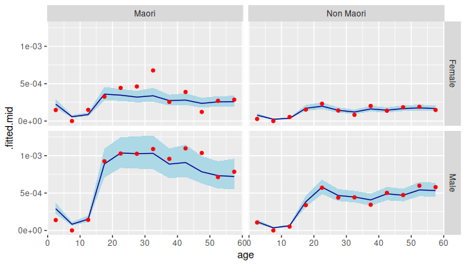
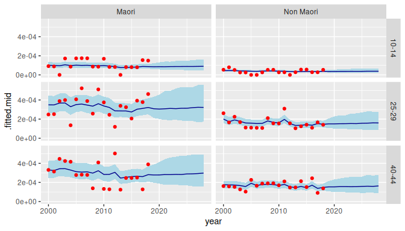

# Overview

## 1 Introduction

(= “Bayesian” + “age”) implements Bayesian hierarchical models for
rates, probabilities, and means. The rates, probabilities, and means are
cross-classified by variables such as age, sex, region, and time. Models
in can be used for estimation and for forecasting.

models are built out of smaller submodels. A model for mortality rates,
for instance, might contain submodels describing how rates vary over
age, sex, and time.

Internally, draws on package
[TMB](https://CRAN.R-project.org/package=TMB) for fitting. `TMB` is fast
and can handle large datasets.

This vignette introduces the main features of , using data on injuries
as a case study.

For more details, see the
[website](https://bayesiandemography.github.io/bage/). The [Mathematical
Details](https://bayesiandemography.github.io/bage/articles/vig02_math.html)
article, for instance, provides mathematical descriptions of the models.

## 2 Preliminaries

### 2.1 Packages

We begin by loading the packages that we will need for analysing the
injuries data. Loading automatically loads package `rvec`, which
contains functions for working with draws from probability
distributions. Package `poputils` contains functions for working with
demographic data. Packages `dplyr` and `tidyr` are core
[tidyverse](https://tidyverse.org/) packages for manipulating data. We
use `ggplot2` for graphics.

``` r
library(bage)
library(poputils)
library(dplyr)
library(tidyr)
library(ggplot2)
```

### 2.2 Data

We analyse a dataset called `nzl_injuries`. The dataset is included in .
It contains counts of fatal injuries and population in New Zealand,
classified by age, sex, ethnicity, and year.

``` r
head(nzl_injuries)
#> # A tibble: 6 × 6
#>   age   sex    ethnicity  year injuries  popn
#>   <fct> <chr>  <chr>     <int>    <int> <int>
#> 1 0-4   Female Maori      2000       12 35830
#> 2 5-9   Female Maori      2000        6 35120
#> 3 10-14 Female Maori      2000        3 32830
#> 4 15-19 Female Maori      2000        6 27130
#> 5 20-24 Female Maori      2000        6 24380
#> 6 25-29 Female Maori      2000        6 24160
```

``` r
nzl_injuries |>
  filter(year %in% c(2000, 2006, 2012, 2018)) |>
  ggplot(aes(x = age_mid(age), y = injuries / popn, color = sex)) +
  facet_grid(vars(ethnicity), vars(year)) +
  geom_line() +
  xlab("age") +
  theme(legend.position = "top",
        legend.title = element_blank())
```


## 3 Specifying a model

### 3.1 Functions for specifying models

We specify a model where counts of injuries are treated as a random
draws from Poisson distributions. The expected number of injuries varies
with different combinations of age, sex, ethnicity, and year.

``` r
mod <- mod_pois(injuries ~ age * sex + age * ethnicity + year,
                data = nzl_injuries,
                exposure = popn)
```

Binomial models are specified with function
[`mod_binom()`](https://bayesiandemography.github.io/bage/reference/mod_binom.md)
and normal models with function
[`mod_norm()`](https://bayesiandemography.github.io/bage/reference/mod_norm.md).

### 3.2 Model structure

The resulting model has the following structure:


The number of injuries occurring within each combination of age, sex,
ethnicity, and time reflects (i) the population at risk and (ii) an
underlying rate that in is referred to as `.fitted`. The expected value
for `.fitted` is obtained by summing up values for the intercept, age
effect, sex effect, and so forth. The actual value of `.fitted` can
diverge from `.expected`: the amount of divergence is governed by the
`disp` (dispersion) parameter.

The model terms are all given “prior distributions”. A prior
distribution is a submodel capturing features of the unknown quantity or
quantities being estimated. Possible features include the range within
which the quantity is likely to fall, or the amount of smoothness
expected in series of values. Priors distributions are a distinctive
feature of Bayesian methods.

### 3.3 Printing the model object

Printing a model object provides information on its structure:

``` r
mod
#> 
#>     ------ Unfitted Poisson model ------
#> 
#>    injuries ~ age * sex + age * ethnicity + year
#> 
#>                  exposure: popn
#> 
#>           term  prior along n_par n_par_free
#>    (Intercept) NFix()     -     1          1
#>            age   RW()   age    12         12
#>            sex NFix()     -     2          2
#>      ethnicity NFix()     -     2          2
#>           year   RW()  year    19         19
#>        age:sex   RW()   age    24         24
#>  age:ethnicity   RW()   age    24         24
#> 
#>  disp: mean = 1
#> 
#>  n_draw var_time var_age var_sexgender
#>    1000     year     age           sex
```

The table in the the middle of the printout above shows the default
prior distribution assigned to each term. We return to priors in Section
[6](#sec:priors).

The bottom row of the printed object shows various model settings.
`n_draw` is the number of random draws produced by extractor functions,
which we discuss in Section [5](#sec:outputs). `var_time`, `var_age`,
and `var_sexgender` are the names of the variables in `nzl_injuries`
that represent time, age, and sex or gender. If fails to correctly
identify these variables, they can be identified using functions such as
[`set_var_time()`](https://bayesiandemography.github.io/bage/reference/set_var_time.md).

## 4 Fitting a model

### 4.1 fit()

Function
[`mod_pois()`](https://bayesiandemography.github.io/bage/reference/mod_pois.md)
specifies a model, but does not actually estimate any of the unknown
quantities in the model. For that, we need function
[`fit()`](https://generics.r-lib.org/reference/fit.html).

``` r
mod <- mod |>
  fit()
```

### 4.2 Reprinting the model object

The printout for a fitted model differs from that of an unfitted model.

``` r
mod
#> 
#>     ------ Fitted Poisson model ------
#> 
#>    injuries ~ age * sex + age * ethnicity + year
#> 
#>                  exposure: popn
#> 
#>           term  prior along n_par n_par_free std_dev
#>    (Intercept) NFix()     -     1          1       -
#>            age   RW()   age    12         12    0.71
#>            sex NFix()     -     2          2    0.11
#>      ethnicity NFix()     -     2          2    0.36
#>           year   RW()  year    19         19    0.09
#>        age:sex   RW()   age    24         24    0.43
#>  age:ethnicity   RW()   age    24         24    0.13
#> 
#>  disp: mean = 1
#> 
#>  n_draw var_time var_age var_sexgender optimizer
#>    1000     year     age           sex    nlminb
#> 
#>  time_total time_max time_draw iter converged                    message
#>        0.78     0.32      0.38   11      TRUE   relative convergence (4)
```

Among other things, a new row appears at the bottom of the printout,
providing information about the fitting process. The most important
value piece of information is whether the calculations have converged.

One thing the printout does not include is estimates for the model
parameters. The reason for excluding them is that there are too many.
Statistical models in other R packages often focus on one or two key
parameters, such a parameter measuring a treatment effect. In contrast,
models in often estimate values for thousands, or tens of thousands, of
parameters.

To obtain the estimates from a fitted model, we need specialised
extractor functions, which we discuss next.

## 5 Extracting outputs

### 5.1 Extractor functions

The two most important extractor functions in are
[`augment()`](https://generics.r-lib.org/reference/augment.html) and
[`components()`](https://generics.r-lib.org/reference/components.html).
Both of these are generic functions that work on many sorts of R objects
(see [here](https://generics.r-lib.org/index.html) and
[here](https://www.tidymodels.org/learn/develop/broom/#glossary)).

### 5.2 augment()

[`augment()`](https://generics.r-lib.org/reference/augment.html) returns
the original dataset plus some additional columns of estimated values,

``` r
aug <- mod |>
  augment()
aug
#> # A tibble: 912 × 9
#>    age   sex    ethnicity  year injuries  popn .observed
#>    <fct> <chr>  <chr>     <int>    <int> <int>     <dbl>
#>  1 0-4   Female Maori      2000       12 35830 0.000335 
#>  2 5-9   Female Maori      2000        6 35120 0.000171 
#>  3 10-14 Female Maori      2000        3 32830 0.0000914
#>  4 15-19 Female Maori      2000        6 27130 0.000221 
#>  5 20-24 Female Maori      2000        6 24380 0.000246 
#>  6 25-29 Female Maori      2000        6 24160 0.000248 
#>  7 30-34 Female Maori      2000       12 22560 0.000532 
#>  8 35-39 Female Maori      2000        3 22230 0.000135 
#>  9 40-44 Female Maori      2000        6 18130 0.000331 
#> 10 45-49 Female Maori      2000        6 13770 0.000436 
#> # ℹ 902 more rows
#> # ℹ 2 more variables: .fitted <rdbl<1000>>, .expected <rdbl<1000>>
```

The additional columns are `.observed`, `.fitted`, and `.expected`.

``` r
aug |>
  select(.observed, .fitted, .expected) 
#> # A tibble: 912 × 3
#>    .observed                    .fitted                  .expected
#>        <dbl>               <rdbl<1000>>               <rdbl<1000>>
#>  1 0.000335    3e-04 (0.00023, 0.00039)   3e-04 (0.00026, 0.00034)
#>  2 0.000171    7.8e-05 (5.7e-05, 1e-04) 7.5e-05 (6.2e-05, 9.1e-05)
#>  3 0.0000914   1e-04 (7.6e-05, 0.00014)   1e-04 (8.7e-05, 0.00012)
#>  4 0.000221  0.00041 (0.00031, 0.00053)     0.00045 (4e-04, 5e-04)
#>  5 0.000246  0.00038 (0.00029, 0.00048)   4e-04 (0.00036, 0.00045)
#>  6 0.000248  0.00035 (0.00027, 0.00045) 0.00037 (0.00032, 0.00041)
#>  7 0.000532  0.00038 (0.00029, 0.00049) 0.00036 (0.00032, 0.00041)
#>  8 0.000135  0.00031 (0.00024, 0.00041)   0.00034 (3e-04, 0.00039)
#>  9 0.000331  0.00033 (0.00026, 0.00044) 0.00033 (0.00029, 0.00038)
#> 10 0.000436    0.00031 (0.00024, 4e-04)   3e-04 (0.00027, 0.00035)
#> # ℹ 902 more rows
```

In a Poisson model with exposures,

- `.observed` is a “direct” estimate of the rate, obtained by dividing
  the the outcome variable by the population at risk;
- `.expected` is a model-based estimate of the rate, based purely on
  model predictors (eg age, sex, time); and
- `.fitted` is a model-based estimate of the rate that is a compromise
  between `.observed` and `.expected`.

### 5.3 components()

[`components()`](https://generics.r-lib.org/reference/components.html)
is used to extract values for higher-level parameters. It returns values
for all the parameters.

``` r
comp <- mod |>
  components()
comp
#> # A tibble: 89 × 4
#>    term        component level                  .fitted
#>    <chr>       <chr>     <chr>             <rdbl<1000>>
#>  1 (Intercept) effect    (Intercept) -1.6 (-3.4, 0.033)
#>  2 age         effect    0-4          -1.7 (-3.4, 0.13)
#>  3 age         effect    5-9          -2.9 (-4.7, -1.1)
#>  4 age         effect    10-14       -2.5 (-4.2, -0.66)
#>  5 age         effect    15-19       -0.85 (-2.6, 0.95)
#>  6 age         effect    20-24        -0.77 (-2.5, 1.1)
#>  7 age         effect    25-29          -0.87 (-2.6, 1)
#>  8 age         effect    30-34          -0.93 (-2.6, 1)
#>  9 age         effect    35-39       -0.93 (-2.8, 0.99)
#> 10 age         effect    40-44       -0.93 (-2.8, 0.98)
#> # ℹ 79 more rows
```

The output from
[`components()`](https://generics.r-lib.org/reference/components.html)
may require a bit of tidying,

``` r
age_effect <- comp |>
  filter(term == "age",
         component == "effect") |>
  select(age = level, .fitted)
age_effect
#> # A tibble: 12 × 2
#>    age              .fitted
#>    <chr>       <rdbl<1000>>
#>  1 0-4    -1.7 (-3.4, 0.13)
#>  2 5-9    -2.9 (-4.7, -1.1)
#>  3 10-14 -2.5 (-4.2, -0.66)
#>  4 15-19 -0.85 (-2.6, 0.95)
#>  5 20-24  -0.77 (-2.5, 1.1)
#>  6 25-29    -0.87 (-2.6, 1)
#>  7 30-34    -0.93 (-2.6, 1)
#>  8 35-39 -0.93 (-2.8, 0.99)
#>  9 40-44 -0.93 (-2.8, 0.98)
#> 10 45-49 -0.99 (-2.8, 0.95)
#> 11 50-54  -0.96 (-2.9, 1.1)
#> 12 55-59  -0.95 (-2.8, 1.1)
```

### 5.4 Posterior samples

The output from a Bayesian model is draws from the “posterior
distribution” for unknown quantities. The posterior distribution is a
probability distribution that describes what is implied about the
unknown quantities in the model after the combining model assumptions
(including priors) and the data.

### 5.5 Rvecs

Draws from probability distributions can be awkward to work with, so
uses a special type of vector called an “rvec”, implemented by package
`rvec`. An rvec contains multiple draws, but tries to behave as much as
possible like a standard vector. The printout of `.fitted` and
`.expected` in the `aug` object above shows medians and 95% credible
intervals.

### 5.6 Graphing outputs

The best way to understand output from a fitted model it to graph it. We
first need to prepare data for the graph. We select values for 2018 and
use the
[`draws_ci()`](https://bayesiandemography.github.io/rvec/reference/draws_ci.html)
function from `rvec` to create 95% credible intervals.

``` r
data_plot <- aug |>
  filter(year == 2018) |>
  mutate(draws_ci(.fitted))
data_plot |>
  select(starts_with(".fitted"))
#> # A tibble: 48 × 4
#>                       .fitted .fitted.lower .fitted.mid .fitted.upper
#>                  <rdbl<1000>>         <dbl>       <dbl>         <dbl>
#>  1 0.00023 (0.00017, 0.00029)     0.000173    0.000225      0.000290 
#>  2   5.8e-05 (4.1e-05, 8e-05)     0.0000411   0.0000582     0.0000803
#>  3 8.7e-05 (6.5e-05, 0.00011)     0.0000649   0.0000871     0.000115 
#>  4 0.00036 (0.00027, 0.00046)     0.000274    0.000360      0.000457 
#>  5 0.00035 (0.00027, 0.00043)     0.000270    0.000346      0.000428 
#>  6   0.00032 (0.00025, 4e-04)     0.000249    0.000320      0.000404 
#>  7 0.00034 (0.00026, 0.00044)     0.000258    0.000338      0.000444 
#>  8 0.00027 (0.00021, 0.00035)     0.000206    0.000274      0.000352 
#>  9 0.00028 (0.00022, 0.00037)     0.000215    0.000281      0.000372 
#> 10 0.00024 (0.00018, 0.00031)     0.000179    0.000236      0.000312 
#> # ℹ 38 more rows
```

We then use
[`ggplot()`](https://ggplot2.tidyverse.org/reference/ggplot.html) to
visualise the outputs. A good way to display output is to use
[`geom_ribbon()`](https://ggplot2.tidyverse.org/reference/geom_ribbon.html)
to plot credible intervals,
[`geom_line()`](https://ggplot2.tidyverse.org/reference/geom_path.html)
to plot model-based point estimates, and
[`geom_point()`](https://ggplot2.tidyverse.org/reference/geom_point.html)
to plot direct estimates.

``` r
ggplot(data_plot, aes(x = age_mid(age))) +
  facet_grid(vars(sex), vars(ethnicity)) +
  geom_ribbon(aes(ymin = .fitted.lower,
                  ymax = .fitted.upper),
              fill = "lightblue") +
  geom_line(aes(y = .fitted.mid),
            color = "darkblue") +
  geom_point(aes(y = .observed),
             color = "red") +
  xlab("age")
```



## 6 Priors

### 6.1 Priors in Bayesian models

In a Bayesian model, every parameter needs to be assigned a prior
distribution. When the data provides abundant information about the
parameter, the particular choice of prior distribution usually has
little effect on the ultimate estimates for the parameter. But when the
data provides only limited information, different priors can lead to
very different estimates. The choice of prior is particularly important
when forecasting, since the data provides provides only indirect
information about the future.

### 6.2 Current priors in bage

[`help(priors)`](https://bayesiandemography.github.io/bage/reference/priors.md)
produces a list of priors that have been implemented in .

Some examples:

- [`NFix()`](https://bayesiandemography.github.io/bage/reference/NFix.md).
  Each element of the term being modeled is drawn from a normal
  distribution with mean `0`, and standard deviation `sd`. By default,
  `sd` is 1.
- [`N()`](https://bayesiandemography.github.io/bage/reference/N.md).
  Like
  [`NFix()`](https://bayesiandemography.github.io/bage/reference/NFix.md),
  but `sd` is estimated from the data.
- [`RW()`](https://bayesiandemography.github.io/bage/reference/RW.md).
  The elements of the term being modeled follow a random walk. This is
  appropriate for terms involving time and age, where neighboring
  elements are strongly correlated.
- [`AR1()`](https://bayesiandemography.github.io/bage/reference/AR1.md).
  First-order autoregressive process. Suitable for time series that
  revert to a mean value.

### 6.3 Defaults

uses the following rules to assign default priors to a model term:

- if the term has less than 3 elements, use
  [`NFix()`](https://bayesiandemography.github.io/bage/reference/NFix.md);
- otherwise, if the term involves time, use
  [`RW()`](https://bayesiandemography.github.io/bage/reference/RW.md),
  with time as the \`along’ dimension;
- otherwise, if the term involves age, use
  [`RW()`](https://bayesiandemography.github.io/bage/reference/RW.md),
  with age as the \`along’ dimension;
- otherwise, use
  [`N()`](https://bayesiandemography.github.io/bage/reference/N.md).

Priors can be over-ridden using
[`set_prior()`](https://bayesiandemography.github.io/bage/reference/set_prior.md):

``` r
mod <- mod |>
  set_prior(year ~ AR1())
```

Replacing a prior deletes any existing estimates and returns a model to
an ‘unfitted’ state.

``` r
is_fitted(mod)
#> [1] FALSE
```

So we re-fit the model.

``` r
mod <- mod |>
  fit()
```

### 6.4 SVD-based priors

implements a special type of prior based on applying a singular value
decomposition (SVD) to data from an international database. These
SVD-based priors represent the age-sex patterns in demographic processes
such as fertility, mortality, and labor force participation in a
parsimonious way. The model below, for instance, uses SVD-based priors
for age effects and age-time interactions in a model of regional
fertility rates in Korea. Note that the number of free parameters
(denoted `n_par_free`) for `age` and `age:time` in the printout below is
much less than the total number of parameters (denoted `n_par`) for
`age` and `age:time`.

``` r
mod_births <- mod_pois(births ~ age * region + age * time,
                       data = kor_births,
                       exposure = popn) |>
  set_prior(age ~ SVD(HFD)) |>
  set_prior(age:time ~ SVD_RW(HFD)) |>
  fit()
mod_births
#> 
#>     ------ Fitted Poisson model ------
#> 
#>    births ~ age * region + age * time
#> 
#>                  exposure: popn
#> 
#>         term       prior along n_par n_par_free std_dev
#>  (Intercept)      NFix()     -     1          1       -
#>          age    SVD(HFD)     -     9          3    1.66
#>       region         N()     -    16         16    0.03
#>         time        RW()  time    13         13    0.46
#>   age:region        RW()   age   144        144    0.57
#>     age:time SVD_RW(HFD)  time   117         39    1.89
#> 
#>  disp: mean = 1
#> 
#>  n_draw var_time var_age optimizer
#>    1000     time     age    nlminb
#> 
#>  time_total time_max time_draw iter converged                    message
#>        2.60     1.52      0.95   22      TRUE   relative convergence (4)
```

## 7 Covariates

The main predictors in a model are the variables, such as age and sex,
that are used to classify the outcome. However, does allow additional
variables in `data` to be used as predictors. We refer to these
additional variables as covariates, and we add them to a model using
function
[`set_covariates()`](https://bayesiandemography.github.io/bage/reference/set_covariates.md):

``` r
mod_pois(births ~ age * region + age * time,
         data = kor_births,
         exposure = popn) |>
  set_covariates(~ gdp_pc_2023 + dens_2020)
#> 
#>     ------ Unfitted Poisson model ------
#> 
#>    births ~ age * region + age * time
#> 
#>                  exposure: popn
#> 
#>         term  prior along n_par n_par_free
#>  (Intercept) NFix()     -     1          1
#>          age   RW()   age     9          9
#>       region    N()     -    16         16
#>         time   RW()  time    13         13
#>   age:region   RW()   age   144        144
#>     age:time   RW()  time   117        117
#> 
#>  covariates: ~gdp_pc_2023 + dens_2020
#> 
#>  disp: mean = 1
#> 
#>  n_draw var_time var_age
#>    1000     time     age
```

## 8 Forecasting

Forecasts can be constructed by calling function
[`forecast()`](https://generics.r-lib.org/reference/forecast.html) on a
model object. When the `output` argument of
[`forecast()`](https://generics.r-lib.org/reference/forecast.html) is
`"augment"` (the default),
[`forecast()`](https://generics.r-lib.org/reference/forecast.html)
produces values like those produced by
[`augment()`](https://generics.r-lib.org/reference/augment.html).

``` r
aug_forecast <- mod |>
  forecast(labels = 2019:2028)
names(aug_forecast)
#> [1] "age"       "sex"       "ethnicity" "year"      "injuries"  "popn"     
#> [7] ".observed" ".fitted"   ".expected"
```

When the `output` argument is `"components"`,
[`forecast()`](https://generics.r-lib.org/reference/forecast.html)
produces values like those produced by
[`components()`](https://generics.r-lib.org/reference/components.html).

``` r
comp_forecast <- mod |>
  forecast(labels = 2019:2028,
           output = "components")
comp_forecast
#> # A tibble: 10 × 4
#>    term  component level              .fitted
#>    <chr> <chr>     <chr>         <rdbl<1000>>
#>  1 year  effect    2019  -0.088 (-0.35, 0.16)
#>  2 year  effect    2020  -0.082 (-0.39, 0.27)
#>  3 year  effect    2021  -0.074 (-0.45, 0.29)
#>  4 year  effect    2022   -0.066 (-0.5, 0.33)
#>  5 year  effect    2023   -0.059 (-0.5, 0.36)
#>  6 year  effect    2024  -0.061 (-0.52, 0.39)
#>  7 year  effect    2025  -0.045 (-0.54, 0.41)
#>  8 year  effect    2026   -0.039 (-0.58, 0.4)
#>  9 year  effect    2027  -0.033 (-0.57, 0.42)
#> 10 year  effect    2028  -0.021 (-0.57, 0.45)
```

When the argument `include_estimates` is `TRUE`, the return value
includes historical estimates. This is useful for plotting.

``` r
data_forecast <- mod |>
  fit() |>
  forecast(labels = 2019:2028,
           include_estimates = TRUE) |>
  filter(sex == "Female",
         age %in% c("10-14", "25-29", "40-44")) |>
  mutate(draws_ci(.fitted))

ggplot(data_forecast, aes(x = year)) +
  facet_grid(vars(age), vars(ethnicity)) +
  geom_ribbon(aes(ymin = .fitted.lower,
                  ymax = .fitted.upper),
              fill = "lightblue") +
  geom_line(aes(y = .fitted.mid),
            color = "darkblue") +
  geom_point(aes(y = .observed),
             color = "red")  
#> Warning: Removed 60 rows containing missing values or values outside the scale range
#> (`geom_point()`).
```



## 9 Imputation

automatically accommodates missing values in the outcome variables. We
illustrate with a version of the injuries dataset where values for
2010–2014 are set to `NA`.

``` r
years_mis <- 2010:2014

injuries_mis <- nzl_injuries |>
  mutate(injuries = if_else(year %in% years_mis, NA, injuries))
```

We fit our exactly the same model that we use for the complete dataset.

``` r
mod_mis <- mod_pois(injuries ~ age * sex + age * ethnicity + year,
                    data = injuries_mis,
                    exposure = popn) |>
  fit()
```

creates a new variable, called `.injuries` containing imputed values for
the missing outcomes.

``` r
mod_mis |>
  augment() |>
  filter(year %in% years_mis)
#> # A tibble: 240 × 10
#>    age   sex    ethnicity  year injuries    .injuries  popn .observed
#>    <fct> <chr>  <chr>     <int>    <int> <rdbl<1000>> <int>     <dbl>
#>  1 0-4   Female Maori      2010       NA   12 (5, 20) 43440        NA
#>  2 5-9   Female Maori      2010       NA     3 (0, 7) 36340        NA
#>  3 10-14 Female Maori      2010       NA     3 (0, 8) 35520        NA
#>  4 15-19 Female Maori      2010       NA   14 (7, 23) 34960        NA
#>  5 20-24 Female Maori      2010       NA   12 (5, 20) 31060        NA
#>  6 25-29 Female Maori      2010       NA    8 (3, 14) 24000        NA
#>  7 30-34 Female Maori      2010       NA    8 (3, 14) 23180        NA
#>  8 35-39 Female Maori      2010       NA    8 (3, 14) 24260        NA
#>  9 40-44 Female Maori      2010       NA    7 (2, 12) 22660        NA
#> 10 45-49 Female Maori      2010       NA    6 (2, 12) 21730        NA
#> # ℹ 230 more rows
#> # ℹ 2 more variables: .fitted <rdbl<1000>>, .expected <rdbl<1000>>
```

Rates estimates in years where the outcome is missing have wider
credible intervals than rates estimates in years where the outcome is
observed.

``` r
data_plot_mis <- mod_mis |>
  augment() |>
  filter(age == "20-24") |>
  mutate(draws_ci(.fitted))

ggplot(data_plot_mis, aes(x = year)) +
  facet_grid(vars(sex), vars(ethnicity)) +
  geom_ribbon(aes(ymin = .fitted.lower,
                  ymax = .fitted.upper),
              fill = "lightblue") +
  geom_line(aes(y = .fitted.mid),
            color = "darkblue") +
  geom_point(aes(y = .observed),
             color = "red") +
  xlab("age")
#> Warning: Removed 20 rows containing missing values or values outside the scale range
#> (`geom_point()`).
```


If the value for exposure, size, or weights is missing, then the
associated row from `data` is omitted from the likelihood, and no
imputations for that row are made. Missing values for classifying
variables are skipped over in the same way.

## 10 Data models

Many datasets in applied demography have some sort of measurement error:
units within the target population are missed, for instance, or are
double-counted. In , measurement error can be explicitly incorporated
into the analysis by adding a “data model” (also known as a measurement
error model) to the base model.

Consider, for example, as dataset where, because of errors in the data
collection process, responses for females are expected to be inflated by
5% and responses for males are expected to be inflated by 6%. We might
extend our base model as follows:

``` r
prob_under <- data.frame(sex =  c("Female", "Male"),
                         mean = c(0.05,     0.06),
             disp = c(0.02,     0.02))

mod_under <- mod |>
  set_datamod_undercount(prob = prob_under) 
```

The current choice of data models in can be views by calling
`help(datamod)`.

## 11 Confidentialization

Data producers often confidentialize their data before they make it
publicly available. The `nzl_injuries` dataset is one example.
Statistics New Zealand has randomly-rounded the counts of injuries to
multiples of 3.

To deal with confidentialization, we describe the confidentialization
process to our model.

``` r
mod <- mod |>
  set_confidential_rr3() |>
  fit()
```

The results from calling
[`augment()`](https://generics.r-lib.org/reference/augment.html) now
include a variable called `.injuries` with estimated values for the
true, unrounded injury counts.

``` r
mod |>
  augment()
#> # A tibble: 912 × 10
#>    age   sex    ethnicity  year injuries    .injuries  popn .observed
#>    <fct> <chr>  <chr>     <int>    <int> <rdbl<1000>> <int>     <dbl>
#>  1 0-4   Female Maori      2000       12  12 (10, 14) 35830 0.000335 
#>  2 5-9   Female Maori      2000        6     5 (4, 7) 35120 0.000171 
#>  3 10-14 Female Maori      2000        3     3 (1, 5) 32830 0.0000914
#>  4 15-19 Female Maori      2000        6     7 (5, 8) 27130 0.000221 
#>  5 20-24 Female Maori      2000        6     6 (4, 8) 24380 0.000246 
#>  6 25-29 Female Maori      2000        6     6 (4, 8) 24160 0.000248 
#>  7 30-34 Female Maori      2000       12  12 (10, 14) 22560 0.000532 
#>  8 35-39 Female Maori      2000        3     4 (2, 5) 22230 0.000135 
#>  9 40-44 Female Maori      2000        6     6 (4, 8) 18130 0.000331 
#> 10 45-49 Female Maori      2000        6     6 (4, 8) 13770 0.000436 
#> # ℹ 902 more rows
#> # ℹ 2 more variables: .fitted <rdbl<1000>>, .expected <rdbl<1000>>
```

## 12 Model checking

### 12.1 Replicate data

A standard Bayesian approach to checking a model is to use the model to
generate simulate data and see if the simulated data looks like the
actual data. Function
[`replicate_data()`](https://bayesiandemography.github.io/bage/reference/replicate_data.md)
creates multiple sets of simulated data.

``` r
rep_data <- mod |>
  replicate_data()
rep_data
#> # A tibble: 18,240 × 7
#>    .replicate age   sex    ethnicity  year injuries  popn
#>    <fct>      <fct> <chr>  <chr>     <int>    <dbl> <int>
#>  1 Original   0-4   Female Maori      2000       12 35830
#>  2 Original   5-9   Female Maori      2000        6 35120
#>  3 Original   10-14 Female Maori      2000        3 32830
#>  4 Original   15-19 Female Maori      2000        6 27130
#>  5 Original   20-24 Female Maori      2000        6 24380
#>  6 Original   25-29 Female Maori      2000        6 24160
#>  7 Original   30-34 Female Maori      2000       12 22560
#>  8 Original   35-39 Female Maori      2000        3 22230
#>  9 Original   40-44 Female Maori      2000        6 18130
#> 10 Original   45-49 Female Maori      2000        6 13770
#> # ℹ 18,230 more rows
```

Comparing full datasets is difficult, so the usual strategy is to
calculate summary measures that capture some important feature of the
data, and compare those instead. Here we see if the model is properly
capturing male-female differences in injury rates.

``` r
sex_ratio <- rep_data |>
  count(.replicate, year, sex, wt = injuries) |>
  pivot_wider(names_from = sex, values_from = n) |>
  mutate(ratio = Male / Female)
sex_ratio
#> # A tibble: 380 × 5
#>    .replicate  year Female  Male ratio
#>    <fct>      <int>  <dbl> <dbl> <dbl>
#>  1 Original    2000    279   873  3.13
#>  2 Original    2001    276   846  3.07
#>  3 Original    2002    303   855  2.82
#>  4 Original    2003    330   873  2.65
#>  5 Original    2004    306   840  2.75
#>  6 Original    2005    300   876  2.92
#>  7 Original    2006    291   828  2.85
#>  8 Original    2007    321   843  2.63
#>  9 Original    2008    339   864  2.55
#> 10 Original    2009    303   900  2.97
#> # ℹ 370 more rows
```

We graph the results and see if the original data looks like it was
drawn from the same underlying distribution as the simulated data.

``` r
ggplot(sex_ratio, aes(x = year, y = ratio)) +
  facet_wrap(vars(.replicate)) +
  geom_line()
```


### 12.2 Simulation studies

A simulation study, where we create the data ourselves and hence know
the true values for the parameters, can be a useful way of assessing
model performance. In the example below, we use function
[`report_sim()`](https://bayesiandemography.github.io/bage/reference/report_sim.md)
to perform a simple simulation study where the true population is
generated using a first-order random walk, but the estimation model
assumes that the population is generated using a second-order random
walk.

``` r
set.seed(0)

## Create simulated data
fake_data <- data.frame(year = 2001:2010, 
                        population = NA)

## Define the true data-generating model
mod_rw <- mod_pois(population ~ year,
                   data = fake_data,
                   exposure = 1) |>
  set_prior(`(Intercept)` ~ NFix(sd = 0.1)) |>
  set_prior(year ~ RW(s = 0.1, sd = 0.1))

## Define the estimation model
mod_rw2 <- mod_pois(population ~ year,
                    data = fake_data,
                    exposure = 1) |>
  set_prior(year ~ RW2())

## Run the simulation
report_sim(mod_est = mod_rw2,
           mod_sim = mod_rw,
       n_sim = 10) ## ideally should be 1000 or more
#> $components
#> # A tibble: 3 × 7
#>   term        component  .error .cover_50 .cover_95 .length_50 .length_95
#>   <chr>       <chr>       <dbl>     <dbl>     <dbl>      <dbl>      <dbl>
#> 1 (Intercept) effect    -0.0908       1           1       1.11       3.24
#> 2 year        effect    -0.0852       0.9         1       1.49       4.35
#> 3 disp        disp      -0.0293       0.4         1       1.24       4.93
#> 
#> $augment
#> # A tibble: 2 × 6
#>   .var       .error .cover_50 .cover_95 .length_50 .length_95
#>   <chr>       <dbl>     <dbl>     <dbl>      <dbl>      <dbl>
#> 1 .fitted   -0.270       0.43      0.97      0.854       2.88
#> 2 .expected -0.0655      0.75      1         1.06        4.69
```

### 12.3 Prior predictive checks

Another way of gaining insights about a model is to look at estimates
based purely on the priors, without using data on the outcome variable.
This is referred to as a ‘prior predictive check’. In , prior predictive
checks can be done by calling
[`augment()`](https://generics.r-lib.org/reference/augment.html),
[`components()`](https://generics.r-lib.org/reference/components.html)
or [`forecast()`](https://generics.r-lib.org/reference/forecast.html) on
an unfitted version of the model.

``` r
mod |>
  unfit() |>
  components()
#> # A tibble: 90 × 4
#>    term        component level                  .fitted
#>    <chr>       <chr>     <chr>             <rdbl<1000>>
#>  1 (Intercept) effect    (Intercept)    0.011 (-1.8, 2)
#>  2 age         effect    0-4            0.061 (-1.9, 2)
#>  3 age         effect    5-9            0.1 (-2.9, 2.8)
#>  4 age         effect    10-14        0.013 (-3.5, 3.6)
#>  5 age         effect    15-19       -0.051 (-3.9, 4.1)
#>  6 age         effect    20-24          0.035 (-4.5, 5)
#>  7 age         effect    25-29         0.07 (-5.2, 5.2)
#>  8 age         effect    30-34        0.064 (-5.9, 5.5)
#>  9 age         effect    35-39        0.098 (-6.7, 5.8)
#> 10 age         effect    40-44         0.11 (-7.2, 6.3)
#> # ℹ 80 more rows
```

## 13 Future development of bage

### 13.1 Future features

is a new package, and still under very active development. Some features
that are next on the list are:

- **Priors** More options for priors, eg a damped randomw walk.
- **Documentation** More vignettes and examples.
- **Model choice** Tools for model comparison and model choice

### 13.2 Experimental status

currently has an [](https://lifecycle.r-lib.org/articles/stages.html#experimental)
life cycle badge, to warn users that some features of the interface,
such as function arguments, are still evolving. We hope to graduate from
experimental status by the end of 2025.

### 13.3 Bug reports and feature requests

We would be grateful for bug reports or suggestions for features. The
best way to do so is to raise an issue on the [bage GitHub
repository](https://github.com/bayesiandemography/bage/issues).
