# Priors

## 1 Set-up

``` r
suppressPackageStartupMessages({
  library(bage)
  library(poputils)
  library(ggplot2)
  library(dplyr)
})  
```

``` r
plot_exch <- function(draws) {
  ggplot(draws, aes(x = element, y = value)) +
    facet_wrap(vars(draw), nrow = 1) +
    geom_hline(yintercept = 0, col = "grey") +
    geom_point(col = "darkblue", size = 0.7) +
    scale_x_continuous(n.breaks = max(draws$element)) +
    xlab("Unit") +
    ylab("") +
    theme(text = element_text(size = 8))
}          
```

``` r
plot_cor_one <- function(draws) {
  ggplot(draws, aes(x = along, y = value)) +
    facet_wrap(vars(draw), nrow = 1) +
    geom_hline(yintercept = 0, col = "grey") +
    geom_line(col = "darkblue") +
    xlab("Unit") +
    ylab("") +
    theme(text = element_text(size = 8))
}          
```

``` r
plot_cor_many <- function(draws) {
  ggplot(draws, aes(x = along, y = value)) +
    facet_grid(vars(by), vars(draw)) +
    geom_hline(yintercept = 0, col = "grey") +
    geom_line(col = "darkblue") +
    xlab("Unit") +
    ylab("") +
    theme(text = element_text(size = 8))
}          
```

``` r
plot_svd_one <- function(draws) {
  ggplot(draws, aes(x = age_mid(age), y = value, color = sex)) +
    facet_wrap(vars(draw), nrow = 1) +
    geom_line() +
    scale_color_manual(values = c("darkgreen", "darkorange")) +
    xlab("Age") +
    ylab("") +
    theme(text = element_text(size = 8),
          legend.position = "top",
          legend.title = element_blank())
}
```

``` r
plot_svd_many <- function(draws) {
  draws |>
    mutate(element = paste("Unit", element)) |>
    ggplot(aes(x = age_mid(age), y = value, color = sex)) +
    facet_grid(vars(element), vars(draw)) +
    geom_line() +
    scale_color_manual(values = c("darkgreen", "darkorange")) +
    xlab("Age") +
    ylab("") +
    theme(text = element_text(size = 8),
          legend.position = "top",
          legend.title = element_blank())
}
```

## 2 Exchangeable Units

### 2.1 Fixed Normal `NFix()`

#### 2.1.1 Model

\\\begin{equation} \beta_j \sim \text{N}(0, \mathtt{sd}^2)
\end{equation}\\

#### 2.1.2 All defaults

`sd = 1`

``` r
set.seed(0)

NFix() |>
  generate(n_element = 10, n_draw = 8) |>
  plot_exch()
```


#### 2.1.3 Reduce `sd`

`sd = 0.01`

``` r
set.seed(0)

NFix(sd = 0.01) |>
  generate(n_element = 10, n_draw = 8) |>
  plot_exch()
```


### 2.2 Normal `N()`

#### 2.2.1 Model

\\\begin{align} \beta_j & \sim \text{N}(0, \tau^2) \\ \tau & \sim
\text{N}^+(0, \mathtt{s}) \end{align}\\

#### 2.2.2 All defaults

`s = 1`

``` r
set.seed(0)

N() |>
  generate(n_element = 10, n_draw = 8) |>
  plot_exch()
```


#### 2.2.3 Reduce `s`

`s = 0.01`

``` r
set.seed(0)

N(s = 0.01) |>
  generate(n_element = 10, n_draw = 8) |>
  plot_exch()
```


## 3 Units Correlated With Neighbours

### 3.1 Random Walk `RW()`

#### 3.1.1 Model

\\\begin{align} \beta_1 & \sim \text{N}(0, \mathtt{sd}^2) \\ \beta_j &
\sim \text{N}(\beta\_{j-1}, \tau^2), \quad j = 2, \cdots, J \\ \tau &
\sim \text{N}^+(0, \mathtt{s}^2) \end{align}\\

#### 3.1.2 All defaults

`s = 1`, `sd = 1`

``` r
set.seed(0)

RW() |>
  generate(n_draw = 8) |>
  plot_cor_one()
```


#### 3.1.3 Reduce `s`

`s = 0.01`, `sd = 1`

``` r
set.seed(0)

RW(s = 0.01) |>
  generate(n_draw = 8) |>
  plot_cor_one()
```

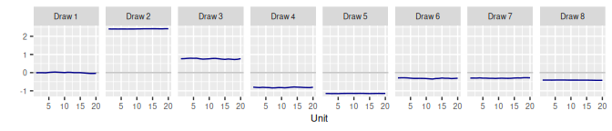

#### 3.1.4 Reduce `s` and `sd`

`s = 0.01`, `sd = 0`

``` r
set.seed(0)

RW(s = 0.01, sd = 0) |>
  generate(n_draw = 8) |>
  plot_cor_one()
```

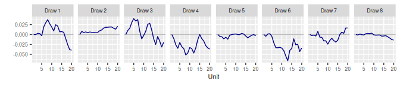

### 3.2 Second-Order Random Walk `RW2()`

#### 3.2.1 Model

\\\begin{align} \beta_1 & \sim \text{N}(0, \mathtt{sd}^2) \\ \beta_2 &
\sim \text{N}(\beta_1, \mathtt{sd\\slope}^2) \\ \beta_j & \sim
\text{N}(2\beta\_{j-1} - \beta\_{j-2}, \tau^2), \quad j = 3, \cdots, J
\\ \tau & \sim \text{N}^+(0, \mathtt{s}^2) \end{align}\\

#### 3.2.2 All defaults

`s = 1`, `sd = 1`, `sd_slope = 1`

``` r
set.seed(0)

RW2() |>
  generate(n_draw = 8) |>
  plot_cor_one()
```

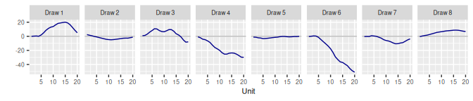

#### 3.2.3 Reduce `s`

`s = 0.01`, `sd = 1`, `sd_slope = 1`

``` r
set.seed(0)

RW2(s = 0.01) |>
  generate(n_draw = 8) |>
  plot_cor_one()
```


#### 3.2.4 Reduce `s` and `sd_slope`

`s = 0.01`, `sd = 1`, `sd_slope = 0.01`

``` r
set.seed(0)

RW2(s = 0.01, sd_slope = 0.01) |>
  generate(n_draw = 8) |>
  plot_cor_one()
```


#### 3.2.5 Reduce `s`, `sd`, and `sd_slope`

`s = 0.01`, `sd = 0`, `sd_slope = 0.01`

``` r
set.seed(0)

RW2(s = 0.01, sd = 0, sd_slope = 0.01) |>
  generate(n_draw = 8) |>
  plot_cor_one()
```


### 3.3 Autoregressive `AR()`

#### 3.3.1 Model

\\\begin{equation} \beta_j \sim \text{N}\left(\phi_1 \beta\_{j-1} +
\cdots + \phi\_{\mathtt{n\\coef}} \beta\_{j-\mathtt{n\\coef}},
\omega^2\right) \end{equation}\\ TMB derives a value of \\\omega\\ that
gives each \\\beta_j\\ variance \\\tau^2\\. The prior for \\\tau\\ is
\\\begin{equation} \tau \sim \text{N}^+(0, \mathtt{s}^2).
\end{equation}\\ The prior for each \\\phi_k\\ is \\\begin{equation}
\frac{\phi_k + 1}{2} \sim \text{Beta}(\mathtt{shape1}, \mathtt{shape2}).
\end{equation}\\

#### 3.3.2 All defaults

`n_coef = 2`, `s = 1`

``` r
set.seed(0)

AR() |>
  generate(n_draw = 8) |>
  plot_cor_one()
```

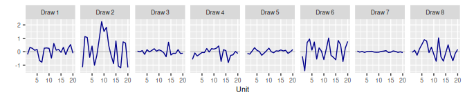

#### 3.3.3 Increase `n_coef`

``` r
set.seed(0)

AR(n_coef = 3) |>
  generate(n_draw = 8) |>
  plot_cor_one()
```


#### 3.3.4 Reduce `s`

``` r
set.seed(0)

AR(s = 0.01) |>
  generate(n_draw = 8) |>
  plot_cor_one()
```

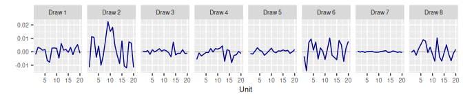

#### 3.3.5 Specify ‘along’ and ‘by’ dimensions

``` r
set.seed(0)

AR() |>
  generate(n_along = 20, n_by = 3, n_draw = 8) |>
  plot_cor_many()
```


#### 3.3.6 Specify ‘along’ and ‘by’ dimensions, set `con = "by"`

``` r
set.seed(0)

AR(con = "by") |>
  generate(n_along = 20, n_by = 3, n_draw = 8) |>
  plot_cor_many()
```

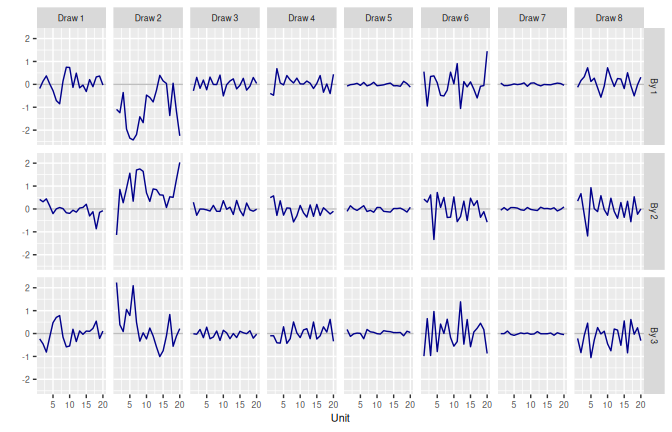

### 3.4 First-Order Autoregressive `AR1()`

#### 3.4.1 Model

\\\begin{equation} \beta_j \sim \text{N}\left(\phi \beta\_{j-1},
\omega^2\right) \end{equation}\\ TMB derives a value of \\\omega\\ that
gives each \\\beta_j\\ variance \\\tau^2\\. The prior for \\\tau\\ is
\\\begin{equation} \tau \sim \text{N}^+(0, \mathtt{s}^2).
\end{equation}\\ The prior for \\\phi\\ is \\\begin{equation}
\frac{\phi - \mathtt{min}}{\mathtt{max} - \mathtt{min}} \sim
\text{Beta}(\mathtt{shape1}, \mathtt{shape2}). \end{equation}\\

#### 3.4.2 All defaults

`s = 1`, `min = 0.8`, `max = 0.98`

``` r
set.seed(0)

AR1() |>
  generate(n_draw = 8) |>
  plot_cor_one()
```

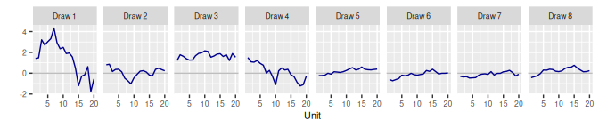

#### 3.4.3 Reduce `s`

``` r
set.seed(0)

AR1(s = 0.01) |>
  generate(n_draw = 8) |>
  plot_cor_one()
```

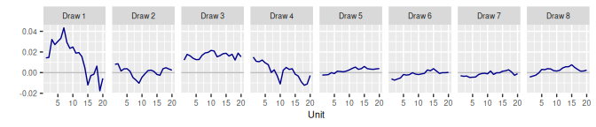

#### 3.4.4 Reduce `s` and modify `min`, `max`

``` r
set.seed(0)

AR1(s = 0.01, min = -1, max = 1) |>
  generate(n_draw = 8) |>
  plot_cor_one()
```

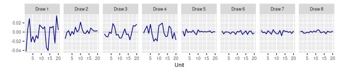

### 3.5 Random Walk with Seasonal Effects `RW_Seas()`

#### 3.5.1 Model

\\\begin{align} \beta_j & = \alpha_j + \lambda_j \\ \alpha_1 & \sim
\text{N}(0, \mathtt{sd}^2) \\ \alpha_j & \sim \text{N}(\alpha\_{j-1},
\tau^2), \quad j = 2, \cdots, J \\ \tau & \sim \text{N}^+\left(0,
\mathtt{s}^2\right) \\ \lambda_j & \sim \text{N}(0,
\mathtt{sd\\seas}^2), \quad j = 1, \cdots, \mathtt{n\\seas} - 1 \\
\lambda_j & = -\sum\_{s=1}^{j-1} \lambda\_{j-s}, \quad j =
\mathtt{n\\seas},\\ 2 \mathtt{n\\seas}, \cdots \\ \lambda_j & \sim
\text{N}(\lambda\_{j-\mathtt{n\\seas}}, \omega^2), \quad
\text{otherwise} \\ \omega & \sim \text{N}^+\left(0,
\mathtt{s\\seas}^2\right) \end{align}\\

#### 3.5.2 All defaults plus `s_seas = 0`

`s = 1`, `sd = 1`, `sd_seas = 1`, `s_seas = 0`,

``` r
set.seed(0)

RW_Seas(n_seas = 4, s_seas = 0) |>
  generate(n_draw = 8) |>
  plot_cor_one()
```

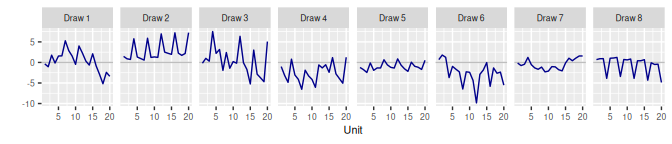

#### 3.5.3 Reduce `s`, `sd`

`s = 0.01`, `sd = 0`, `s_seas = 0`

``` r
set.seed(0)

RW_Seas(n_seas = 4, s = 0.01, sd = 0, s_seas = 0) |>
  generate(n_draw = 8) |>
  plot_cor_one()
```


#### 3.5.4 Increase `s_seas`

`s = 0.01`, `sd = 0`, `s_seas = 1`, `sd_seas = 1`

``` r
set.seed(0)

RW_Seas(n_seas = 4, s = 0.01, sd = 0, s_seas = 1) |>
  generate(n_draw = 8) |>
  plot_cor_one()
```


#### 3.5.5 Reduce `sd_seas`

`s = 0.01`, `sd = 0`, `s_seas = 1`, `s_seas = 0`, `sd_seas = 0.01`

``` r
set.seed(0)

RW_Seas(n_seas = 4, s = 0.01, sd = 0, s_seas = 0, sd_seas = 0.01) |>
  generate(n_draw = 8) |>
  plot_cor_one()
```

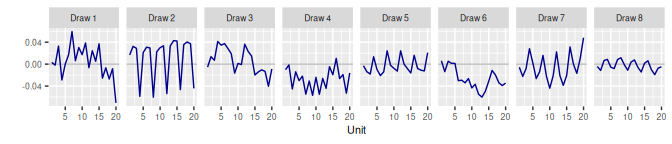

### 3.6 Second-Order Random Walk with Seasonal Effects `RW2_Seas()`

#### 3.6.1 Model

\\\begin{align} \beta_j & = \alpha_j + \lambda_j \\ \alpha_1 & \sim
\text{N}(0, \mathtt{sd}^2) \\ \alpha_2 & \sim \text{N}(\alpha_1,
\mathtt{sd\\slope}^2) \\ \alpha_j & \sim \text{N}(2\alpha\_{j-1} -
\alpha\_{j-2}, \tau^2), \quad j = 3, \cdots, J \\ \tau & \sim
\text{N}^+\left(0, \mathtt{s}^2\right) \\ \lambda_j & \sim \text{N}(0,
\mathtt{sd\\seas}^2), \quad j = 1, \cdots, \mathtt{n\\seas} - 1 \\
\lambda_j & = -\sum\_{s=1}^{j-1} \lambda\_{j-s}, \quad j =
\mathtt{n\\seas},\\ 2 \mathtt{n\\seas}, \cdots \\ \lambda_j & \sim
\text{N}(\lambda\_{j-\mathtt{n\\seas}}, \omega^2), \quad
\text{otherwise} \\ \omega & \sim \text{N}^+\left(0,
\mathtt{s\\seas}^2\right) \end{align}\\

#### 3.6.2 All defaults, plus `s_seas = 0`

`s = 1`, `sd = 1`, `sd_slope = 1`, `s_seas = 0`, `sd_seas = 1`

``` r
set.seed(0)

RW2_Seas(n_seas = 4, s_seas = 0) |>
  generate(n_draw = 8) |>
  plot_cor_one()
```


#### 3.6.3 Reduce `s`, `sd`, `sd_slope`, `sd_seas`

`s = 0.01`, `sd = 0`, `sd_slope = 0.01`, `s_seas = 0`, `sd_seas = 0.01`

``` r
set.seed(0)

RW2_Seas(n_seas = 4, s = 0.01, sd = 0, sd_slope = 0.01,
         s_seas = 0, sd_seas = 0.01) |>
  generate(n_draw = 8) |>
  plot_cor_one()
```


### 3.7 Linear `Lin()`

#### 3.7.1 Model

\\\begin{align} \beta_j & = \alpha_j + \epsilon_j \\ \alpha_j & =
\left(j - \frac{J + 1}{2}\right) \eta \\ \eta & \sim
\text{N}\left(\mathtt{mean\\slope}, \mathtt{sd\\slope}^2 \right) \\
\epsilon & \sim \text{N}(0, \tau^2) \\ \tau & \sim \text{N}^+\left(0,
\mathtt{s}^2\right) \end{align}\\

#### 3.7.2 All defaults

`s = 1`, `mean_slope = 0`, `sd_slope = 1`

``` r
set.seed(0)

Lin() |>
  generate(n_draw = 8) |>
  plot_cor_one()
```


#### 3.7.3 Reduce `s`

`s = 0`, `mean_slope = 0`, `sd_slope = 1`

``` r
set.seed(0)

Lin(s = 0) |>
  generate(n_draw = 8) |>
  plot_cor_one()
```

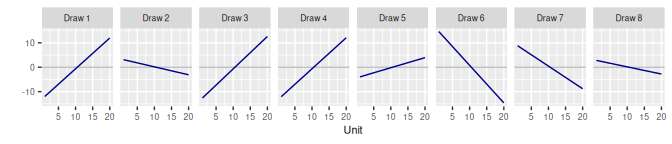

#### 3.7.4 Modify `mean_slope`, `sd_slope`

`s = 1`, `mean_slope = 0.2`, `sd_slope = 0.1`

``` r
set.seed(0)

Lin(mean_slope = 0.2, sd_slope = 0.1) |>
  generate(n_draw = 8) |>
  plot_cor_one()
```


#### 3.7.5 Specify ‘along’ and ‘by’ dimensions

``` r
set.seed(0)

Lin() |>
  generate(n_along = 20, n_by = 3, n_draw = 8) |>
  plot_cor_many()
```

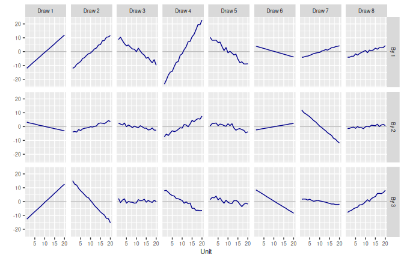

#### 3.7.6 Specify ‘along’ and ‘by’ dimensions, set `con = "by"`

``` r
set.seed(0)

Lin(con = "by") |>
  generate(n_along = 20, n_by = 3, n_draw = 8) |>
  plot_cor_many()
```

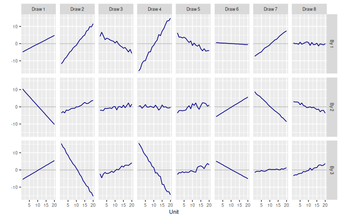

### 3.8 Linear with AR Errors `Lin_AR()`

#### 3.8.1 Model

\\\begin{align} \beta_j & = \alpha_j + \epsilon_j \\ \alpha_j & =
\left(j - \frac{J + 1}{2}\right) \eta \\ \eta & \sim
\text{N}\left(\mathtt{mean\\slope}, \mathtt{sd\\slope}^2 \right) \\
\epsilon_j & \sim \text{N}\left(\phi_1 \epsilon\_{j-1} + \cdots +
\phi\_{\mathtt{n\\coef}} \epsilon\_{j-\mathtt{n\\coef}}, \omega^2\right)
\tau & \sim \text{N}^+\left(0, \mathtt{s}^2\right) \\ \frac{\phi_k +
1}{2} & \sim \text{Beta}(\mathtt{shape1}, \mathtt{shape2}) \end{align}\\

#### 3.8.2 All defaults

`n_coef = 2`, `s = 1`, `mean_slope = 0`, `sd_slope = 1`

``` r
set.seed(0)

Lin_AR() |>
  generate(n_draw = 8) |>
  plot_cor_one()
```

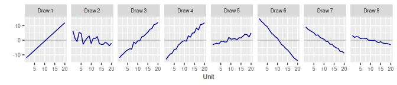

#### 3.8.3 Reduce `s`, `sd_slope`

`s = 0.1`, `mean_slope = 0`, `sd_slope = 0.01`

``` r
set.seed(0)

Lin_AR(s = 0.1, sd_slope = 0.01) |>
  generate(n_draw = 8) |>
  plot_cor_one()
```

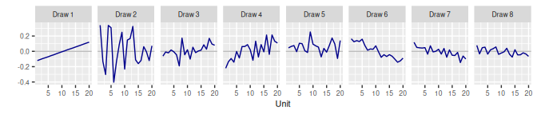

### 3.9 Linear with AR1 Errors `Lin_AR1()`

#### 3.9.1 Model

\\\begin{align} \beta_j & = \alpha_j + \epsilon_j \\ \alpha_j & =
\left(j - \frac{J + 1}{2}\right) \eta \\ \eta & \sim
\text{N}\left(\mathtt{mean\\slope}, \mathtt{sd\\slope}^2 \right) \\
\epsilon_j & \sim \text{N}\left(\phi \epsilon\_{j-1}, \omega^2\right)
\tau & \sim \text{N}^+\left(0, \mathtt{s}^2\right) \\ \frac{\phi -
\mathtt{min}}{\mathtt{max} - \mathtt{min}} \sim
\text{Beta}(\mathtt{shape1}, \mathtt{shape2}) \end{align}\\

#### 3.9.2 All defaults

`s = 1`, `min = 0.8`, `max = 0.98`, `mean_slope = 0`, `sd_slope = 1`

``` r
set.seed(0)

Lin_AR1() |>
  generate(n_draw = 8) |>
  plot_cor_one()
```


#### 3.9.3 Modify `min`, `max`

`s = 1`, `min = -1`, `max = 1`, `mean_slope = 0`, `sd_slope = 1`

``` r
set.seed(0)

Lin_AR1(min = -1, max = 1) |>
  generate(n_draw = 8) |>
  plot_cor_one()
```

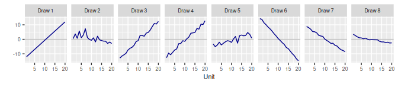

#### 3.9.4 Reduce `s`, `sd_slope`

`s = 0.1`, `min = 0.8`, `max = 0.98`, `mean_slope = 0`,
`sd_slope = 0.02`

``` r
set.seed(0)

Lin_AR1(s = 0.1, sd_slope = 0.02) |>
  generate(n_draw = 8) |>
  plot_cor_one()
```

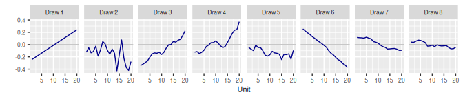

### 3.10 Penalised Spline `Sp()`

#### 3.10.1 Model

\\\begin{align} \pmb{\beta} & = \bm{X} \pmb{\alpha} \\ \alpha_1 & \sim
\text{N}(0, \mathtt{sd}^2) \\ \alpha_2 & \sim \text{N}(\alpha_1,
\mathtt{sd\\slope}^2) \\ \alpha_j & \sim \text{N}(2\alpha\_{j-1} -
\alpha\_{j-2}, \tau^2), \quad j = 3, \cdots, J \\ \tau & \sim
\text{N}^+\left(0, \mathtt{s}^2\right) \\ \end{align}\\

#### 3.10.2 All defaults

`n_comp = NULL`, `s = 1`, `sd = 1`, `sd_slope = 1`

``` r
set.seed(0)

Sp() |>
  generate(n_draw = 8) |>
  plot_cor_one()
```

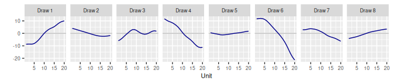

#### 3.10.3 Specify `n_comp`

`n_comp = 15`, `s = 1`, `sd = 1`, `sd_slope = 1`

``` r
set.seed(0)

Sp(n_comp = 5) |>
  generate(n_draw = 8) |>
  plot_cor_one()
```

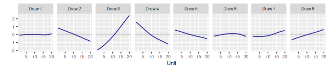

#### 3.10.4 Reduce `s`, `sd`, `sd_slope`

`n_comp = NULL`, `s = 0.01`, `sd = 0.01`, `sd_slope = 0.01`

``` r
set.seed(0)

Sp(s = 0.01, sd = 0.01, sd_slope = 0.01) |>
  generate(n_draw = 8) |>
  plot_cor_one()
```


## 4 SVD-Based Priors

### 4.1 Exchangeable `SVD()`

#### 4.1.1 Model

\\\begin{equation} \pmb{\beta} = \pmb{F} \pmb{\alpha} + \pmb{g}
\end{equation}\\

#### 4.1.2 All defaults

`n_comp = NULL`, `indep = TRUE`

``` r
set.seed(0)

SVD(HMD) |>
  generate(n_draw = 8) |>
  plot_svd_one()
```

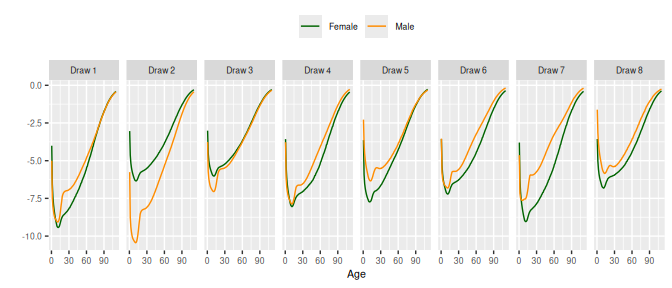

#### 4.1.3 Increase `n_comp`

`n_comp = 5`, `indep = TRUE`

``` r
SVD(HMD, n_comp = 5) |>
  generate(n_draw = 8) |>
  plot_svd_one()
```


#### 4.1.4 Set `indep` to `FALSE`

``` r
SVD(HMD, indep = FALSE) |>
  generate(n_draw = 8) |>
  plot_svd_one()
```


#### 4.1.5 Multiple units

``` r
SVD(HMD, indep = FALSE) |>
  generate(n_draw = 8, n_element = 3) |>
  plot_svd_many()
```


### 4.2 Dynamic SVD Prior: `SVD_AR()`

``` r
SVD_AR(HMD, indep = FALSE, s = 0.1) |>
  generate(n_draw = 6, n_along = 5) |>
    ggplot(aes(x = age_mid(age), 
                      y = value, 
                      color = sex)) +
      facet_grid(vars(draw), vars(along)) +
      geom_line() +
      scale_color_manual(values = c("darkgreen", "darkorange")) +
      xlab("Age") +
      ylab("") +
      theme(text = element_text(size = 8),
            legend.position = "top",
            legend.title = element_blank())
```

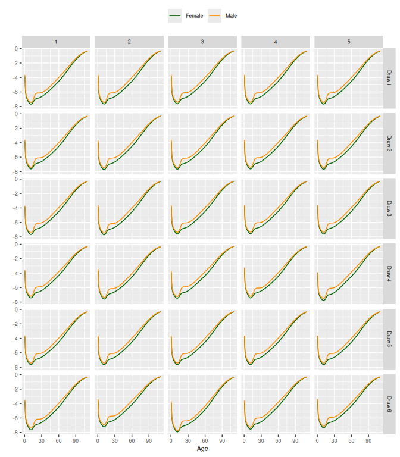
