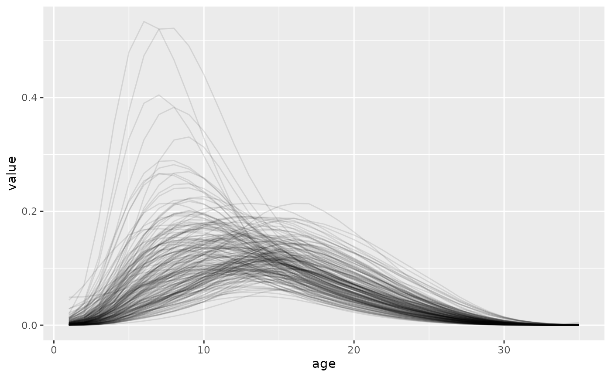

# 4. Singular Value Decomposition

``` r
library(bage)
#> Loading required package: rvec
#> 
#> Attaching package: 'rvec'
#> The following objects are masked from 'package:stats':
#> 
#>     sd, var
#> The following object is masked from 'package:base':
#> 
#>     rank
library(dplyr, warn.conflicts = FALSE)
library(ggplot2)
```

``` r
draws <- generate(HFD, n_draw = 200, age_labels = 15:49) |>
  mutate(age = as.integer(age),
         value = exp(value))
ggplot(draws, aes(x = age, y = value, group = draw)) +
  geom_line(alpha = 0.1)
```


