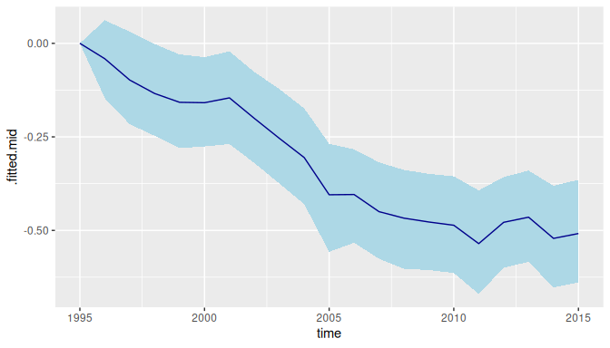
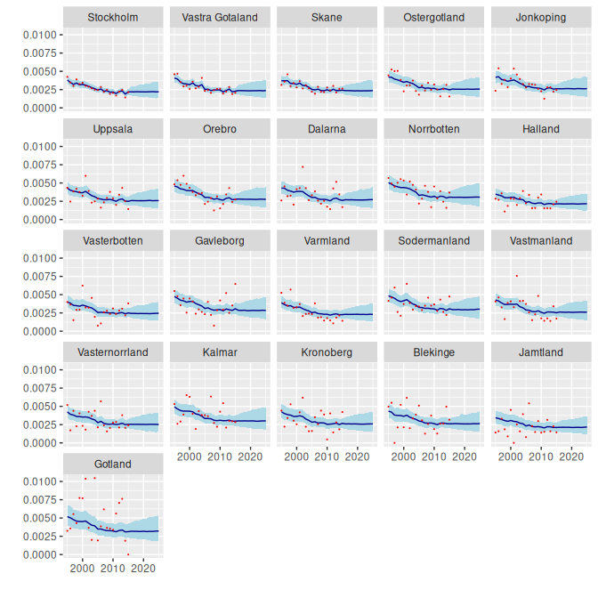

# Examples from BDEF Book

## 1 Introduction

This vignette uses `bage` to replicate, with a few differences, case
studies in the book [Bayesian Demographic Estimation and
Forecasting](https://www.bdef-book.com) (BDEF). BDEF uses our R package
[demest](https://github.com/statisticsnz/demest). However, we strongly
recommend using `bage` instead. `bage` is faster, more stable, and has a
nicer interface. We are no longer developing `demest`, and are focusing
on `bage`.

In addition to `bage`, the vignette uses the tidyverse packages `dplyr`,
`tidyr`, and `ggplot2`.

``` r
library(bage)
library(dplyr)
library(tidyr)
library(ggplot2)
```

The vignette includes notes aimed at readers of BDEF, pointing out
differences between the models in `bage` and the models in BDEF, and
explaning why we made the changes.

> **BDEF Note**
>
> BDEF notes look like this.

## 2 Infant Mortality in Sweden

### 2.1 Aims and data

We estimate and forecast infant mortality in Swedish counties. Following
standard demographic practice we define the infant mortality rate as the
probability of dying during the first year of life, calculated using
this year’s infant deaths and this year’s births. (See Chapter 11 of
BDEF on why this definition is slightly odd.)

Data for the analysis is in the `swe_infant` dataset in `bage`:

``` r
swe_infant
#> # A tibble: 441 × 4
#>    county     time births deaths
#>    <fct>     <int>  <int>  <int>
#>  1 Stockholm  1995  22626     96
#>  2 Stockholm  1996  21354     74
#>  3 Stockholm  1997  20646     62
#>  4 Stockholm  1998  20815     81
#>  5 Stockholm  1999  20863     68
#>  6 Stockholm  2000  21837     75
#>  7 Stockholm  2001  22622     68
#>  8 Stockholm  2002  24084     70
#>  9 Stockholm  2003  25028     67
#> 10 Stockholm  2004  25779     64
#> # ℹ 431 more rows
```

The figure below shows direct estimates of infant mortality rates. Each
panel depicts one county. The panels are ordered from top left to bottom
right by the number of births in each county.

``` r
ggplot(swe_infant, aes(x = time, y = deaths / births)) +
  facet_wrap(vars(county)) +
  geom_line()
```


### 2.2 Initial model

Our model uses default settings for all priors and parameters.

``` r
mod <- mod_binom(deaths ~ county + time,
                 data = swe_infant,
                 size = births)
mod
#> 
#>     ------ Unfitted binomial model ------
#> 
#>    deaths ~ county + time
#> 
#>                      size: births
#> 
#>         term  prior along n_par n_par_free
#>  (Intercept) NFix()     -     1          1
#>       county    N()     -    21         21
#>         time   RW()  time    21         21
#> 
#>  disp: mean = 1
#> 
#>  n_draw var_time
#>    1000     time
```

In this model, deaths in county \\c\\ during year \\t\\, denoted
\\y\_{ct}\\, are drawn from a binomial distribution with probability
\\\pi\_{ct}\\ and trials \\w\_{ct}\\, \\\begin{equation} y\_{ct} \sim
\text{binomial}(\pi\_{ct}, w\_{ct}). \end{equation}\\ The probability
\\\pi\_{ct}\\ is in turn drawn from a beta distribution, with expected
value \\\mu\_{ct}\\ and dispersion parameter \\\xi\\, \\\begin{equation}
\pi\_{ct} \sim \text{Beta}(\xi^{-1} \mu\_{ct}, \xi^{-1}\[1 -
\mu\_{ct}\]) \end{equation}\\ Expected value \\\mu\_{ct}\\, transformed
on to a logit scale, depends on three terms: an intercept, a ‘county’
main effect, and a ‘time’ main effect, \\\begin{equation} \text{logit}
\mu\_{ct} = \beta^0 + \beta_c^{\mathcal{C}} + \beta_t^{\mathcal{T}}
\end{equation}\\ Each of these terms has a prior. The intercept has a
‘normal-fixed’ prior, \\\begin{equation} \beta^0 \sim \text{N}(0, 1).
\end{equation}\\ The county main effect has a ‘normal’ prior,
\\\begin{align} \beta_c^{\mathcal{C}} & \sim \text{N}(0,
\tau\_{\mathcal{C}}^2) \\ \tau\_{\mathcal{C}} & \sim \text{N}^+(0, 1).
\end{align}\\ The time main effect has a random walk prior,
\\\begin{align} \beta_t^{\mathcal{T}} & \sim
\text{N}(\beta\_{t-1}^{\mathcal{T}}, \tau\_{\mathcal{C}}^2) \\
\tau\_{\mathcal{C}} & \sim \text{N}^+(0, 1). \end{align}\\ Finally, the
dispersion parameter \\\xi\\ has an expontial prior \\\begin{equation}
\xi \sim \text{Exp}(1). \end{equation}\\

> **BDEF Note**
>
> This model is slightly different from the infant mortality model in
> BDEF. The intercept here has a \\\text{N}(0,1)\\ prior rather than
> \\\text{N}(0,10^2)\\, and the time effect has a random walk prior
> rather than a local level prior. (Local level priors have not yet been
> implemented in `bage`.)

We fit the model. Fitting in `bage` is a lot faster than fitting in
`demest`.

``` r
mod <- mod |>
  fit()
#> Building log-posterior function...
#> Finding maximum...
#> Drawing values for hyper-parameters...
mod
#> 
#>     ------ Fitted binomial model ------
#> 
#>    deaths ~ county + time
#> 
#>                      size: births
#> 
#>         term  prior along n_par n_par_free std_dev
#>  (Intercept) NFix()     -     1          1       -
#>       county    N()     -    21         21    0.11
#>         time   RW()  time    21         21    0.18
#> 
#>  disp: mean = 1
#> 
#>  n_draw var_time optimizer
#>    1000     time    nlminb
#> 
#>  time_total time_max time_draw iter converged                    message
#>        0.61     0.34      0.22   14      TRUE   relative convergence (4)
```

### 2.3 Extracting parameter estimates

We extract the rates estimates.

``` r
aug_init <- mod |>
  augment()
aug_init
#> # A tibble: 441 × 7
#>    county     time births deaths .observed                 .fitted
#>    <fct>     <int>  <int>  <int>     <dbl>            <rdbl<1000>>
#>  1 Stockholm  1995  22626     96   0.00424 0.0038 (0.0033, 0.0044)
#>  2 Stockholm  1996  21354     74   0.00347   0.0035 (0.003, 0.004)
#>  3 Stockholm  1997  20646     62   0.00300 0.0032 (0.0027, 0.0037)
#>  4 Stockholm  1998  20815     81   0.00389  0.0034 (0.0029, 0.004)
#>  5 Stockholm  1999  20863     68   0.00326 0.0031 (0.0027, 0.0037)
#>  6 Stockholm  2000  21837     75   0.00343 0.0032 (0.0028, 0.0037)
#>  7 Stockholm  2001  22622     68   0.00301 0.0031 (0.0027, 0.0036)
#>  8 Stockholm  2002  24084     70   0.00291 0.0029 (0.0026, 0.0034)
#>  9 Stockholm  2003  25028     67   0.00268 0.0028 (0.0024, 0.0032)
#> 10 Stockholm  2004  25779     64   0.00248  0.0026 (0.0023, 0.003)
#> # ℹ 431 more rows
#> # ℹ 1 more variable: .expected <rdbl<1000>>
```

We use function
[`draws_ci()`](https://bayesiandemography.github.io/rvec/reference/draws_ci.html)
from package **rvec** to calculate 95% credible intervals.

``` r
aug_init <- aug_init |>
  mutate(draws_ci(.fitted))
aug_init
#> # A tibble: 441 × 10
#>    county     time births deaths .observed                 .fitted
#>    <fct>     <int>  <int>  <int>     <dbl>            <rdbl<1000>>
#>  1 Stockholm  1995  22626     96   0.00424 0.0038 (0.0033, 0.0044)
#>  2 Stockholm  1996  21354     74   0.00347   0.0035 (0.003, 0.004)
#>  3 Stockholm  1997  20646     62   0.00300 0.0032 (0.0027, 0.0037)
#>  4 Stockholm  1998  20815     81   0.00389  0.0034 (0.0029, 0.004)
#>  5 Stockholm  1999  20863     68   0.00326 0.0031 (0.0027, 0.0037)
#>  6 Stockholm  2000  21837     75   0.00343 0.0032 (0.0028, 0.0037)
#>  7 Stockholm  2001  22622     68   0.00301 0.0031 (0.0027, 0.0036)
#>  8 Stockholm  2002  24084     70   0.00291 0.0029 (0.0026, 0.0034)
#>  9 Stockholm  2003  25028     67   0.00268 0.0028 (0.0024, 0.0032)
#> 10 Stockholm  2004  25779     64   0.00248  0.0026 (0.0023, 0.003)
#> # ℹ 431 more rows
#> # ℹ 4 more variables: .expected <rdbl<1000>>, .fitted.lower <dbl>,
#> #   .fitted.mid <dbl>, .fitted.upper <dbl>
```

And we graph the results.

``` r
ggplot(aug_init, aes(x = time)) +
  facet_wrap(vars(county)) +
  geom_ribbon(aes(ymin = .fitted.lower,
                  ymax = .fitted.upper),
              fill = "lightblue") +
  geom_line(aes(y = .fitted.mid),
            color = "darkblue") +
  geom_point(aes(y = .observed),
             color = "red",
         size = 0.1) +
  xlab("") +
  ylab("")
```


[`components()`](https://generics.r-lib.org/reference/components.html)
returns values for hyper-parameters.

``` r
comp_init <- mod |>
  components()
comp_init  
#> # A tibble: 46 × 4
#>    term        component level                           .fitted
#>    <chr>       <chr>     <chr>                      <rdbl<1000>>
#>  1 (Intercept) effect    (Intercept)           -2.7 (-4.1, -1.4)
#>  2 county      effect    Stockholm          -0.16 (-0.25, -0.07)
#>  3 county      effect    Vastra Gotaland -0.095 (-0.18, -0.0054)
#>  4 county      effect    Skane            -0.099 (-0.2, 0.00067)
#>  5 county      effect    Ostergotland        -0.01 (-0.14, 0.11)
#>  6 county      effect    Jonkoping           0.013 (-0.12, 0.14)
#>  7 county      effect    Uppsala            0.0053 (-0.13, 0.13)
#>  8 county      effect    Orebro              0.07 (-0.055, 0.22)
#>  9 county      effect    Dalarna              0.04 (-0.09, 0.17)
#> 10 county      effect    Norrbotten           0.17 (0.026, 0.31)
#> # ℹ 36 more rows
```

With help from some tidyverse functions we can extract and graph the
intercept,

``` r
intercept <- comp_init |>
  filter(term == "(Intercept)") |>
  mutate(draws_ci(.fitted))

ggplot(intercept, aes(y = level)) +
  geom_pointrange(aes(xmin = .fitted.lower,
                      x = .fitted.mid,
                      xmax = .fitted.upper))
```


the county effect,

``` r
county_effect <- comp_init |>
  filter(term == "county",
         component == "effect") |>
  rename(county = level) |>
  mutate(draws_ci(.fitted))
  
ggplot(county_effect, aes(y = county)) +
  geom_pointrange(aes(xmin = .fitted.lower,
                      x = .fitted.mid,
              xmax = .fitted.upper))
```


and the time effect.

``` r
time_effect <- comp_init |>
  filter(term == "time",
         component == "effect") |>
  rename(time = level) |>
  mutate(time = as.integer(time)) |>
  mutate(draws_ci(.fitted))

ggplot(time_effect, aes(x = time)) +
  geom_ribbon(aes(ymin = .fitted.lower,
                 ymax = .fitted.upper),
          fill = "lightblue") +
  geom_line(aes(y = .fitted.mid),
            color = "darkblue")
```


The county effect and time effect each have `sd` parameters, which we
also extract.

``` r
comp_init |>
  filter(component == "hyper")
#> # A tibble: 2 × 4
#>   term   component level             .fitted
#>   <chr>  <chr>     <chr>        <rdbl<1000>>
#> 1 county hyper     sd     0.14 (0.085, 0.22)
#> 2 time   hyper     sd    0.066 (0.037, 0.11)
```

### 2.4 An aside on weakly-identified effects

The intercept and time effects from our model both have wide credible
intervals. This reflects the fact that they are only weakly identified
by the model and data. Adding a small quantity to each element of the
time effect, and subtracting the same quantity from the intercept, would
make no difference at all to the predictions of the model, and make only
a tiny difference to the posterior probabilities.

In `demest` we deal with the weak identification by standardizing the
estimates. Standardization can, however, introduce new complications,
and we have not implemented it in `bage`.

When an analysis is focused only on lowest-level rates, probabilities,
or means, and higher-level parameters such as time effects are just a
means to an end, weak identification rarely causes any problems. If,
however, the higher-level parameters are of interest, it may be helpful
to experiment with non-default values for parameters. In the model here,
for instance, setting the `sd` parameter for the
[`RW()`](https://bayesiandemography.github.io/bage/reference/RW.md)
prior to 0 fixes the first value of the time effect to 0, leading to a
more strongly-identified time effect.

``` r
mod_ident <- mod_binom(deaths ~ county + time,
                       data = swe_infant,
               size = births) |>
  set_prior(time ~ RW(sd = 0)) |>
  fit()
#> Building log-posterior function...
#> Finding maximum...
#> Drawing values for hyper-parameters...

time_effect_ident <- mod_ident |>
  components() |>
  filter(term == "time",
         component == "effect") |>
  rename(time = level) |>
  mutate(time = as.integer(time)) |>
  mutate(draws_ci(.fitted))

ggplot(time_effect_ident, aes(x = time)) +
  geom_ribbon(aes(ymin = .fitted.lower,
                 ymax = .fitted.upper),
          fill = "lightblue") +
  geom_line(aes(y = .fitted.mid),
            color = "darkblue")
```



### 2.5 Replicate data check

We use a replicate data check to see if, without a county-time
interaction, the model is adequately representing cross-county variation
in the downward trend in mortality.

Function
[`replicate_data()`](https://bayesiandemography.github.io/bage/reference/replicate_data.md)
generates replicate datasets.

``` r
rep_data <- replicate_data(mod)
rep_data
#> # A tibble: 8,820 × 5
#>    .replicate county     time births deaths
#>    <fct>      <fct>     <int>  <int>  <dbl>
#>  1 Original   Stockholm  1995  22626     96
#>  2 Original   Stockholm  1996  21354     74
#>  3 Original   Stockholm  1997  20646     62
#>  4 Original   Stockholm  1998  20815     81
#>  5 Original   Stockholm  1999  20863     68
#>  6 Original   Stockholm  2000  21837     75
#>  7 Original   Stockholm  2001  22622     68
#>  8 Original   Stockholm  2002  24084     70
#>  9 Original   Stockholm  2003  25028     67
#> 10 Original   Stockholm  2004  25779     64
#> # ℹ 8,810 more rows
```

For each replicate, we calculate direct estimates of the infant
mortality rates, fit a line through these estimates, and collect up the
slope.

``` r
calculate_slope <- function(df) coef(lm(rate ~ time, data = df))[["time"]]
slopes <- rep_data |>
  mutate(rate = deaths / births) |>
  group_by(.replicate, county) |>
  nest() |>
  mutate(slope = sapply(data, calculate_slope))

ggplot(slopes, aes(x = .replicate, y = slope)) +
  geom_point(position = position_jitter(width = 0.1)) +
  xlab("") +
  theme(axis.text.x = element_text(angle = 90))
```


The slopes from the original data (on the far left) have aboout the same
level of variability as the slopes from the replicate data. The
implication is that, even without a county-time interaction, the model
is a satisfactory job of representing cross-county variability in the
pace of decline.

### 2.6 Summarizing results through probabilities

We would like to calculate, for each combination of county and time, the
probability that the underlying (super-population) infant mortality rate
is less than 2.5 per 1000. The
[`prob()`](https://bayesiandemography.github.io/rvec/reference/prob.html)
function from **rvec** makes this easy.

``` r
prob_25 <- aug_init |>
  mutate(prob = prob(.fitted < 0.0025))

ggplot(prob_25, aes(x = time, y = prob)) +
  facet_wrap(vars(county)) +
  geom_line()
```


### 2.7 Forecast

We forecast mortality rates through to 2025. By default, the
[`forecast()`](https://generics.r-lib.org/reference/forecast.html)
function returns output that looks like a return value from
[`augment()`](https://generics.r-lib.org/reference/augment.html). When
`include_estimates` is \`TRUE, the output includes historical values.

``` r
vals_forecast <- mod |>
  forecast(labels = 2016:2025,
           include_estimates = TRUE)
#> `components()` for past values...
#> `components()` for future values...
#> `augment()` for future values...
#> `augment()` for past values...
vals_forecast
#> # A tibble: 651 × 7
#>    county     time births deaths .observed                 .fitted
#>    <fct>     <int>  <int>  <dbl>     <dbl>            <rdbl<1000>>
#>  1 Stockholm  1995  22626     96   0.00424 0.0038 (0.0033, 0.0044)
#>  2 Stockholm  1996  21354     74   0.00347   0.0035 (0.003, 0.004)
#>  3 Stockholm  1997  20646     62   0.00300 0.0032 (0.0027, 0.0037)
#>  4 Stockholm  1998  20815     81   0.00389  0.0034 (0.0029, 0.004)
#>  5 Stockholm  1999  20863     68   0.00326 0.0031 (0.0027, 0.0037)
#>  6 Stockholm  2000  21837     75   0.00343 0.0032 (0.0028, 0.0037)
#>  7 Stockholm  2001  22622     68   0.00301 0.0031 (0.0027, 0.0036)
#>  8 Stockholm  2002  24084     70   0.00291 0.0029 (0.0026, 0.0034)
#>  9 Stockholm  2003  25028     67   0.00268 0.0028 (0.0024, 0.0032)
#> 10 Stockholm  2004  25779     64   0.00248  0.0026 (0.0023, 0.003)
#> # ℹ 641 more rows
#> # ℹ 1 more variable: .expected <rdbl<1000>>
```

In contrast to the all-defaults model in Chapter 11 of BDEF, the
all-defaults model here does not yield exploding prediction intervals.

``` r
vals_forecast <- vals_forecast |>
  mutate(draws_ci(.fitted))
  
ggplot(vals_forecast, aes(x = time)) +
  facet_wrap(vars(county)) +
  geom_ribbon(aes(ymin = .fitted.lower,
                  ymax = .fitted.upper),
             fill = "lightblue") +
  geom_line(aes(y = .fitted.mid),
            color = "darkblue") +
  geom_point(aes(y = .observed),
             color = "red",
         size = 0.1) +
  xlab("") +
  ylab("")
#> Warning: Removed 210 rows containing missing values or values outside the scale range
#> (`geom_point()`).
```



## 3 Life expectancy in Portugal

TODO - write this!

## 4 Health expenditure in the Netherlands

TODO - write this!

## 5 Internal migration in Iceland

TODO - write this!
