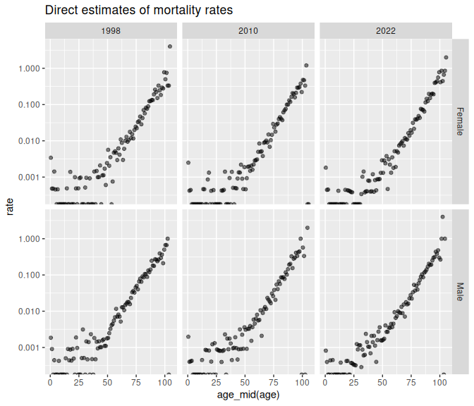
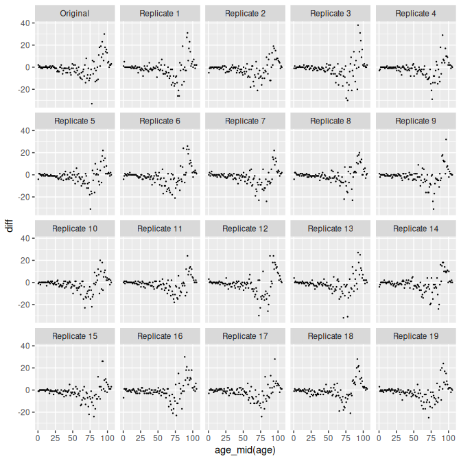

# 6. Modelling Mortality

## 1 Introduction

In this vignette, we estimate mortality rates, and summary indicators
such as life expectancy. We work with data from Iceland. We try several
methods for representing age patterns, including one that uses typically
patterns from the Human Mortality Database. All our model-based
estimates come with measures of uncertainty.

In addition to **bage** itself, we need package **poputils**, which
contains functions for calculating life expectancy, and **rvec**, which
contains data structures and functions for working with random draws.

``` r
library(bage)
#> Loading required package: rvec
#> 
#> Attaching package: 'rvec'
#> The following objects are masked from 'package:stats':
#> 
#>     sd, var
#> The following object is masked from 'package:base':
#> 
#>     rank
library(poputils)
library(rvec)
```

We use standard tidyverse tools for data manipulation and graphing.

``` r
library(dplyr, warn.conflicts = FALSE)
library(tidyr)
library(ggplot2)
```

## 2 The data

The Iceland deaths data is included in the **bage** package. It contains
counts of deaths, and estimates of the mid-year population,
disaggregated by age and sex, for the years 1998–2022.

``` r
dth <- bage::isl_deaths
dth
#> # A tibble: 5,300 × 5
#>    age   sex     time deaths  popn
#>    <fct> <fct>  <int>  <int> <dbl>
#>  1 0     Female  1998      7 2051 
#>  2 1     Female  1998      1 2082.
#>  3 2     Female  1998      1 2088 
#>  4 3     Female  1998      3 2112.
#>  5 4     Female  1998      1 2204 
#>  6 5     Female  1998      0 2232.
#>  7 6     Female  1998      1 2175 
#>  8 7     Female  1998      0 2240 
#>  9 8     Female  1998      0 2261 
#> 10 9     Female  1998      0 2182.
#> # ℹ 5,290 more rows
```

The oldest age group is 105 years and older.

``` r
tail(dth, n = 3)
#> # A tibble: 3 × 5
#>   age   sex    time deaths  popn
#>   <fct> <fct> <int>  <int> <dbl>
#> 1 103   Male   2022      0   1.5
#> 2 104   Male   2022      1   1  
#> 3 105+  Male   2022      0   0
```

The data is sparse. Twenty-two percent of death counts are 0, and half
are 3 or less.

``` r
dth |>
  count(deaths) |>
  mutate(percent = round(100 * n / sum(n)),
         cumulative_percent = cumsum(percent)) |>
  head()
#> # A tibble: 6 × 4
#>   deaths     n percent cumulative_percent
#>    <int> <int>   <dbl>              <dbl>
#> 1      0  1180      22                 22
#> 2      1   701      13                 35
#> 3      2   424       8                 43
#> 4      3   333       6                 49
#> 5      4   239       5                 54
#> 6      5   194       4                 58
```

We plot ‘direct’ estimates of death rates in the first and least years
of the data. Direct estimates are calculated by dividing the number of
deaths by the corresponding population at risk, independently for each
combination of age, sex, and time. The results are shown below, on a log
scale. The dots at the bottom of the graph represent log-rates of
negative infinity, which occur in cells where no deaths were observed.
Random variation obscures any patterns before about age 50. After age
50, rates increase more or less linearly.

``` r
dth |>
  filter(time %in% c(1998, 2010, 2022)) |>
  mutate(rate = deaths / popn) |>
  ggplot(aes(x = age_mid(age), y = rate)) + ## 'age_mid()' returns the mid point
  facet_grid(vars(sex), vars(time)) +       ## of the age group, which is useful
  geom_point(alpha = 0.5) +                 ## for plotting
  scale_y_log10() +
  ggtitle("Direct estimates of mortality rates")
#> Warning in scale_y_log10(): log-10 transformation introduced
#> infinite values.
#> Warning: Removed 6 rows containing missing values or values outside the scale range
#> (`geom_point()`).
```



## 3 Initial model

### 3.1 Specifying the model

We fit an initial simple model. In our prior model, we allow for an
interaction between age and sex, but do not allow for any interactions
involving time. We assume, in other words, that mortality rates rise or
fall at the same rate across all age-sex groups. This assumption is
unlikely to be met exactly in practice, so we revisit it later. We
accept all the default priors for main effects and interactions. As can
be seen at the bottom of the printout,
[`mod_pois()`](https://bayesiandemography.github.io/bage/reference/mod_pois.md)
has guessed which variables represent age, sex, and time. (It bases its
guesses on the variable names.) Age and time main effects, by default,
get “random walk” priors, and other terms get “normal” priors.

But before running the model there is an annoying, but common, problem
with the data with.

It turns out there are 5 cases with non-zero deaths but zero population.

``` r
dth |>
  filter(deaths > 0 & popn == 0)
#> # A tibble: 5 × 5
#>   age   sex     time deaths  popn
#>   <fct> <fct>  <int>  <int> <dbl>
#> 1 104   Male    2001      1     0
#> 2 104   Male    2007      1     0
#> 3 104   Male    2012      1     0
#> 4 104   Female  2019      2     0
#> 5 105+  Male    2020      1     0
```

Population counts for the very old are sometimes unreliable. We modify
the problematic zeros under the assumption that each person lives 0.5
person years before dying.

``` r
dth <- dth |>
  mutate(popn = if_else(deaths > 0 & popn == 0, 0.5, popn))
```

Our model is then

``` r
mod_base <- mod_pois(deaths ~ age * sex + time,
                 data = dth,
                 exposure = popn)
mod_base
#> 
#>     ------ Unfitted Poisson model ------
#> 
#>    deaths ~ age * sex + time
#> 
#>                  exposure: popn
#> 
#>         term  prior along n_par n_par_free
#>  (Intercept) NFix()     -     1          1
#>          age   RW()   age   106        106
#>          sex NFix()     -     2          2
#>         time   RW()  time    25         25
#>      age:sex   RW()   age   212        212
#> 
#>  disp: mean = 1
#> 
#>  n_draw var_time var_age var_sexgender
#>    1000     time     age           sex
```

### 3.2 Mathematical description of the model

The model implemented by `mod_base` assumes that \\\begin{equation} y_i
\sim \text{Poisson}(\gamma_i w_i) \end{equation}\\ where

- \\y_i\\ is deaths in age-sex-time cell \\i\\,
- \\w_i\\ is the population at risk, and
- \\\gamma_i\\ is the underlying death rate.

By modelling deaths as draws from a Poisson distribution, the model
recognizes the contribution of individual-level randomness to observed
death counts. Recognizing individual-level randomness is important when
analyzing data where cell counts are small.

Death rates \\\gamma_i\\ are treated as draws from a Gamma distribution,

\\\begin{equation} \gamma_i \sim \text{Gamma}(\xi^{-1}, (\xi
\mu_i)^{-1}). \end{equation}\\

The expected value for \\\gamma_i\\ is \\\mu_i\\, and the variance is
\\\xi \mu_i^2\\. By modelling \\\gamma_i\\ as a draw from a
distribution, we are recognizing our model is only able to explain some
of the variation in \\\gamma_i\\. Larger values for \\\xi\\ imply more
unexplained variation.

We model \\\mu_i\\, on the log scale, as a sum of factors formed from
the the dimensions of the data, \\\begin{equation} \log \mu_i =
\sum\_{m=0}^4 \beta\_{j_i^m}^{(m)} \end{equation}\\ where

- \\\pmb{\beta}^{(0)}\\ is an intercept,
- \\\pmb{\beta}^{(m)}\\, \\m = 1, \cdots, 4\\, is a main effect or
  interaction, and
- \\j_i^m\\ is the element of \\\pmb{\beta}^{(m)}\\ that is associated
  with cell \\i\\.

Each of the \\\beta^{(m)}\\ in the model for \\\mu_i\\ receives a prior.
The default prior for the intercept is \\\begin{equation} \beta^{(0)}
\sim \text{N}(0, 1) \end{equation}\\

The default prior for age is a first-order random walk, \\\begin{align}
\beta_1^{(1)} & \sim \text{N}(0, 1) \\ \beta_j^{(1)} & \sim
\text{N}(\beta\_{j-1}^{(1)}, \tau_1^2), \quad j = 2, \dots, J_1
\end{align}\\ A random walk prior embodies the idea that we expect
changes from one age group to the next to be relatively small, and that
neighboring age groups are more strongly correlated than distant age
groups.

The value for the standard deviation parameter \\\tau_1\\ is estimated
as part of the model, and has its own prior, \\\begin{equation} \tau_1^2
\sim \text{N}^+(0, 1) \end{equation}\\ \\\text{N}^+(0, 1)\\ denotes a
half-normal distribution, that is, a normal distribution restricted to
non-negative values.

The sex main effect has the prior \\\begin{equation} \beta_j^{(2)} \sim
\text{N}(0, 1) \quad j = 1, 2 \\ \end{equation}\\

The time term \\\beta^{(3)}\\ has the same random-walk prior as the age
effect. The age-sex interaction \\\beta^{(4)}\\ has the same prior as
the sex effect.

Finally, the dispersion term \\\xi\\ has an prior \\\begin{equation}
p(\xi) = e^{-\xi}. \end{equation}\\

### 3.3 Fitting the model

We fit the model by calling function
[`fit()`](https://generics.r-lib.org/reference/fit.html):

``` r
mod_base <- fit(mod_base)
#> Building log-posterior function...
#> Finding maximum...
#> Drawing values for hyper-parameters...
mod_base
#> 
#>     ------ Fitted Poisson model ------
#> 
#>    deaths ~ age * sex + time
#> 
#>                  exposure: popn
#> 
#>         term  prior along n_par n_par_free std_dev
#>  (Intercept) NFix()     -     1          1       -
#>          age   RW()   age   106        106    2.68
#>          sex NFix()     -     2          2    0.08
#>         time   RW()  time    25         25    0.10
#>      age:sex   RW()   age   212        212    0.21
#> 
#>  disp: mean = 1
#> 
#>  n_draw var_time var_age var_sexgender optimizer
#>    1000     time     age           sex    nlminb
#> 
#>  time_total time_max time_draw iter converged                    message
#>        3.00     1.45      1.35   14      TRUE   relative convergence (4)
```

### 3.4 Extracting rates

To extract estimated rates from the fitted model object, we use function
[`augment()`](https://generics.r-lib.org/reference/augment.html).

``` r
aug_base <- augment(mod_base)
aug_base
#> # A tibble: 5,300 × 8
#>    age   sex     time deaths  popn .observed                    .fitted
#>    <fct> <fct>  <int>  <int> <dbl>     <dbl>               <rdbl<1000>>
#>  1 0     Female  1998      7 2051   0.00341     0.0021 (0.0016, 0.0026)
#>  2 1     Female  1998      1 2082.  0.000480 0.00049 (0.00037, 0.00067)
#>  3 2     Female  1998      1 2088   0.000479 0.00026 (0.00019, 0.00037)
#>  4 3     Female  1998      3 2112.  0.00142  0.00017 (0.00011, 0.00024)
#>  5 4     Female  1998      1 2204   0.000454   0.00012 (8e-05, 0.00018)
#>  6 5     Female  1998      0 2232.  0        0.00011 (7.5e-05, 0.00016)
#>  7 6     Female  1998      1 2175   0.000460 9.3e-05 (6.1e-05, 0.00014)
#>  8 7     Female  1998      0 2240   0        7.4e-05 (4.7e-05, 0.00011)
#>  9 8     Female  1998      0 2261   0        7.7e-05 (5.1e-05, 0.00012)
#> 10 9     Female  1998      0 2182.  0        8.2e-05 (5.5e-05, 0.00013)
#> # ℹ 5,290 more rows
#> # ℹ 1 more variable: .expected <rdbl<1000>>
```

Function
[`augment()`](https://generics.r-lib.org/reference/augment.html) starts
with the original data, and adds

- a column called `.observed` containing direct estimates (\\y_i/w_i\\),
- a column called `.fitted` containing estimates of the rates
  (\\\gamma_i\\), and
- a column called `.expected` containing expected values for the rates
  (\\\mu_i\\).

The `.fitted` and `.expected` columns both consist of
[rvecs](https://bayesiandemography.github.io/rvec/reference/rvec.html).
An rvec is a vector-like object that holds multiple draws, in this case
draws from posterior distributions.

Next we extract rates estimates for selected years, and summarize the
posterior distributions.

``` r
rates_base <- aug_base |>
  filter(time %in% c(1998, 2010, 2022)) |>
  select(age, sex, time, .observed, .fitted) |>
  mutate(draws_ci(.fitted))
rates_base
#> # A tibble: 636 × 8
#>    age   sex     time .observed                    .fitted .fitted.lower
#>    <fct> <fct>  <int>     <dbl>               <rdbl<1000>>         <dbl>
#>  1 0     Female  1998  0.00341     0.0021 (0.0016, 0.0026)     0.00164  
#>  2 1     Female  1998  0.000480 0.00049 (0.00037, 0.00067)     0.000371 
#>  3 2     Female  1998  0.000479 0.00026 (0.00019, 0.00037)     0.000187 
#>  4 3     Female  1998  0.00142  0.00017 (0.00011, 0.00024)     0.000113 
#>  5 4     Female  1998  0.000454   0.00012 (8e-05, 0.00018)     0.0000799
#>  6 5     Female  1998  0        0.00011 (7.5e-05, 0.00016)     0.0000748
#>  7 6     Female  1998  0.000460 9.3e-05 (6.1e-05, 0.00014)     0.0000614
#>  8 7     Female  1998  0        7.4e-05 (4.7e-05, 0.00011)     0.0000471
#>  9 8     Female  1998  0        7.7e-05 (5.1e-05, 0.00012)     0.0000506
#> 10 9     Female  1998  0        8.2e-05 (5.5e-05, 0.00013)     0.0000547
#> # ℹ 626 more rows
#> # ℹ 2 more variables: .fitted.mid <dbl>, .fitted.upper <dbl>
```

We plot point estimates and 95% credible intervals for the modelled
estimates, together with the original direct estimates,

``` r
ggplot(rates_base, aes(x = age_mid(age), 
             ymin = .fitted.lower,
             y = .fitted.mid,
             ymax = .fitted.upper)) +
  facet_grid(vars(sex), vars(time)) +
  geom_ribbon(fill = "lightblue") +
  geom_line(col= "darkblue") +
  geom_point(aes(y = .observed),
             size = 0.2) +
  scale_y_log10() +
  ggtitle("Modelled and direct estimates of mortality rates - base model")
#> Warning in scale_y_log10(): log-10 transformation introduced
#> infinite values.
#> Warning: Removed 6 rows containing missing values or values outside the scale range
#> (`geom_point()`).
```


### 3.5 Extracting higher-level terms

We can gain insights into the model by extracting and graphing estimates
of the main effects and interactions, the \\\pmb{\beta}^{(m)}\\.

Estimates of the main effects and interactions, and of other
higher-level parameters, can be obtained with function
[`components()`](https://generics.r-lib.org/reference/components.html).

``` r
comp_base <- components(mod_base)
comp_base
#> # A tibble: 350 × 4
#>    term        component level                 .fitted
#>    <chr>       <chr>     <chr>            <rdbl<1000>>
#>  1 (Intercept) effect    (Intercept) -1.5 (-3.2, 0.13)
#>  2 age         effect    0           -1.5 (-3.1, 0.26)
#>  3 age         effect    1           -2.9 (-4.5, -1.1)
#>  4 age         effect    2           -3.5 (-5.1, -1.8)
#>  5 age         effect    3             -4 (-5.6, -2.2)
#>  6 age         effect    4             -4.3 (-6, -2.5)
#>  7 age         effect    5             -4.3 (-6, -2.6)
#>  8 age         effect    6           -4.5 (-6.2, -2.8)
#>  9 age         effect    7             -4.7 (-6.4, -3)
#> 10 age         effect    8           -4.7 (-6.4, -2.9)
#> # ℹ 340 more rows
```

[`components()`](https://generics.r-lib.org/reference/components.html)
returns a tibble contain estimates of all the higher-level parameters.
To extract the age effect, and prepare it for graphing, we use

``` r
age_effect <- comp_base |>
  filter(component == "effect",
         term == "age") |>
  mutate(draws_ci(.fitted))
```

A graph of the age effect reveals a typical profile for mortality rates,

``` r
ggplot(age_effect,
       aes(x = age_mid(level),
           y = .fitted.mid,
           ymin = .fitted.lower,
           ymax = .fitted.upper)) +
  geom_ribbon(fill = "lightblue") +
  geom_line() +
  ggtitle("Age effect")
```


## 4 Revised model

### 4.1 Mathematical structure

The [Human Mortality Database](https://www.mortality.org) provides
estimates of mortality rates for many countries. Let \\\pmb{M}\\ denote
a matrix holding these estimates, on a log scale. By applying a [Singlar
Value
Decomposition](https://en.wikipedia.org/wiki/Singular_value_decomposition)
to \\\pmb{M}\\, and then rescaling, we can construct a matrix
\\\pmb{F}\\ and a column vector \\\pmb{g}\\, that parsimoniously
summarize the age-profiles, or age-sex profiles, that are observed in
\\\pmb{M}\\. If \\z\\ is a vector of independent draws from a
\\\text{N}(0,1)\\ distribution, then the resulting vector
\\\begin{equation} \pmb{m} = \pmb{F} \pmb{z} + \pmb{g} \end{equation}\\
looks like a randomly-selected column from \\\pmb{M}\\.

We use \\\pmb{F}\\ and \\\pmb{g}\\ to build priors for age effects and
age-sex interactions. The prior for age effects is \\\begin{align}
\pmb{\beta}^{(1)} & = \pmb{F} \pmb{\alpha} + \pmb{g} \\ \alpha_k & \sim
\text{N}(0, 1), \quad k = 1, \cdots, K \end{align}\\ where \\K\\ is
chosen by the user. The prior for age-sex interactions looks the same
except that, by default, the calculations are done separately for each
sex.

### 4.2 Specifying the new model

``` r
mod_hmd <- mod_pois(deaths ~ age:sex + time,
                    data = dth,
                    exposure = popn) |>
  set_prior(age:sex ~ SVD(HMD))
mod_hmd
#> 
#>     ------ Unfitted Poisson model ------
#> 
#>    deaths ~ age:sex + time
#> 
#>                  exposure: popn
#> 
#>         term    prior along n_par n_par_free
#>  (Intercept)   NFix()     -     1          1
#>         time     RW()  time    25         25
#>      age:sex SVD(HMD)     -   212          6
#> 
#>  disp: mean = 1
#> 
#>  n_draw var_time var_age var_sexgender
#>    1000     time     age           sex
```

``` r
mod_hmd <- fit(mod_hmd)
#> Building log-posterior function...
#> Finding maximum...
#> Drawing values for hyper-parameters...
mod_hmd
#> 
#>     ------ Fitted Poisson model ------
#> 
#>    deaths ~ age:sex + time
#> 
#>                  exposure: popn
#> 
#>         term    prior along n_par n_par_free std_dev
#>  (Intercept)   NFix()     -     1          1       -
#>         time     RW()  time    25         25    0.10
#>      age:sex SVD(HMD)     -   212          6    2.79
#> 
#>  disp: mean = 1
#> 
#>  n_draw var_time var_age var_sexgender optimizer
#>    1000     time     age           sex    nlminb
#> 
#>  time_total time_max time_draw iter converged                    message
#>        2.64     1.28      1.19    9      TRUE   relative convergence (4)
```

``` r
aug_hmd <- augment(mod_hmd)

rates_hmd <- aug_hmd |>
  filter(time %in% c(1998, 2010, 2022)) |>
  select(age, sex, time, .observed, .fitted) |>
  mutate(draws_ci(.fitted))

ggplot(rates_hmd, aes(x = age_mid(age), 
             ymin = .fitted.lower,
             y = .fitted.mid,
             ymax = .fitted.upper)) +
  facet_grid(vars(sex), vars(time)) +
  geom_ribbon(fill = "lightblue") +
  geom_line(col= "darkblue") +
  geom_point(aes(y = .observed),
             size = 0.2) +
  scale_y_log10() +
  ggtitle("Modelled and direct estimates of mortality rates - HMD model")
#> Warning in scale_y_log10(): log-10 transformation introduced
#> infinite values.
#> Warning: Removed 6 rows containing missing values or values outside the scale range
#> (`geom_point()`).
```


``` r
comp_hmd <- components(mod_hmd)

age_sex_interact <- comp_hmd |>
  filter(component == "effect",
         term == "age:sex") |>
  separate_wider_delim(level, delim = ".", names = c("age", "sex")) |>
  mutate(draws_ci(.fitted))

ggplot(age_sex_interact,
       aes(x = age_mid(age),
           y = .fitted.mid,
           ymin = .fitted.lower,
           ymax = .fitted.upper)) +
  geom_ribbon(aes(fill = sex),
              alpha = 0.3) +
  geom_line(aes(col = sex)) +
  ggtitle("Age-sex interaction")
```


## 5 Model testing

``` r
rep_data_base <- replicate_data(mod_base, condition_on = "expected")

data <- rep_data_base |>
  filter(time == 2022) |>
  select(-popn) |>
  pivot_wider(names_from = sex, values_from = deaths) |>
  mutate(diff = Female - Male)
```

``` r
ggplot(data, aes(x = age_mid(age), y = diff)) +
  facet_wrap(vars(.replicate)) +
  geom_point(size = 0.2)
```



## 6 Life expectancy and life tables

``` r
lifeexp_hmd <- mod_hmd |>
  augment() |>
  lifeexp(mx = .fitted,
          by = c(time, sex))
lifeexp_hmd
#> # A tibble: 50 × 3
#>     time sex              ex
#>    <int> <fct>  <rdbl<1000>>
#>  1  1998 Female  82 (81, 82)
#>  2  1998 Male    78 (77, 78)
#>  3  1999 Female  82 (81, 82)
#>  4  1999 Male    78 (77, 78)
#>  5  2000 Female  82 (82, 82)
#>  6  2000 Male    78 (78, 79)
#>  7  2001 Female  82 (82, 83)
#>  8  2001 Male    79 (78, 79)
#>  9  2002 Female  82 (82, 83)
#> 10  2002 Male    79 (78, 79)
#> # ℹ 40 more rows
```

``` r
lifeexp_hmd <- mod_hmd |>
  augment() |>
  lifeexp(mx = .fitted,
          by = c(time, sex))
lifeexp_hmd
#> # A tibble: 50 × 3
#>     time sex              ex
#>    <int> <fct>  <rdbl<1000>>
#>  1  1998 Female  82 (81, 82)
#>  2  1998 Male    78 (77, 78)
#>  3  1999 Female  82 (81, 82)
#>  4  1999 Male    78 (77, 78)
#>  5  2000 Female  82 (82, 82)
#>  6  2000 Male    78 (78, 79)
#>  7  2001 Female  82 (82, 83)
#>  8  2001 Male    79 (78, 79)
#>  9  2002 Female  82 (82, 83)
#> 10  2002 Male    79 (78, 79)
#> # ℹ 40 more rows
```
