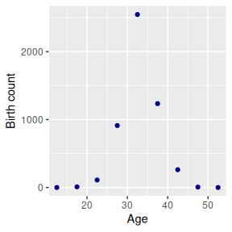
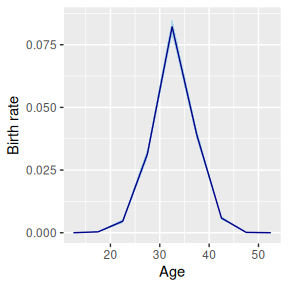
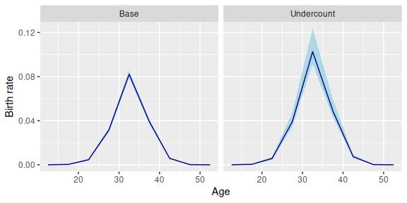
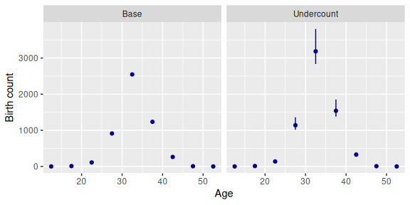
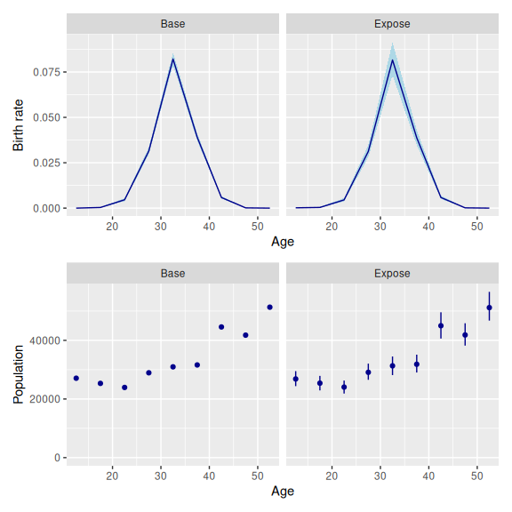
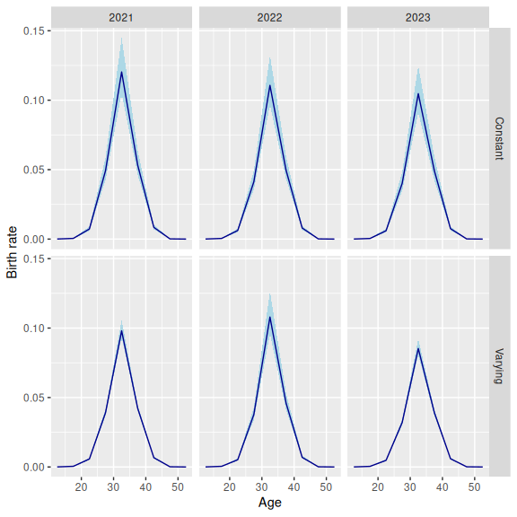
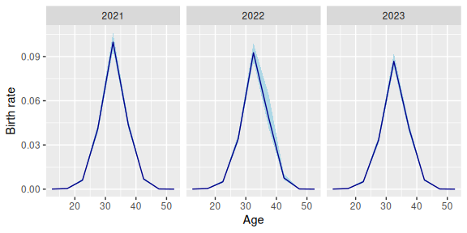

# 10. Data Models

## 1 Introduction

By default, the Poisson, binomial, and normal models in `bage` assume
that any measurement errors in the input data are small enough to be
ignored. These models can, however, be extended to accommodate various
types of measurement error. This is done by adding a “data model”—also
referred to as a “measurement error model”—to the base model. The data
models that have been implemented so far in `bage` are fairly generic:
they aim to perform reasonably well on a wide range of applications,
rather than performing optimally on any particular application. Future
versions of `bage` will add some more specialised data models.

This vignette begins with an overview of the current menu of data
models. It then shows how the simple models presented in the overview
can be extended to deal with more complicated situations, and discusses
forecasting and confidentialization.

The overview will use a model of births in a single Korean province in a
single year. The input data is:

``` r
births
#> # A tibble: 9 × 3
#>   age   births  popn
#>   <chr>  <int> <int>
#> 1 10-14      0 27084
#> 2 15-19      9 25322
#> 3 20-24    110 23935
#> 4 25-29    912 28936
#> 5 30-34   2547 30964
#> 6 35-39   1235 31611
#> 7 40-44    262 44567
#> 8 45-49      6 41774
#> 9 50-54      0 51312
```



Our base model treats the input data as error free. We specify and fit
the base model as follows.

``` r
library(bage)
library(dplyr)
mod_base <- mod_pois(births ~ age,
                     data = births,
                     exposure = popn) |>
  fit()
#> Building log-posterior function...
#> Finding maximum...
#> Drawing values for hyper-parameters...
mod_base
#> 
#>     ------ Fitted Poisson model ------
#> 
#>    births ~ age
#> 
#>                  exposure: popn
#> 
#>         term  prior along n_par n_par_free std_dev
#>  (Intercept) NFix()     -     1          1       -
#>          age   RW()   age     9          9    1.27
#> 
#>  disp: mean = 1
#> 
#>  n_draw var_age optimizer
#>    1000     age    nlminb
#> 
#>  time_total time_max time_draw iter converged
#>        0.84     0.05      0.05   15      TRUE
#>                                            message
#>    both X-convergence and relative convergence (5)
```

The base model yields the following estimates for birth rates:



## 2 Current menu of data models

### 2.1 Overview

`bage` currently implements five generic data models:

| **Model**  | **Assumptions about measurement error**                                       | **Poisson** | **Binomial** | **Normal** |
|:-----------|:------------------------------------------------------------------------------|:------------|:-------------|:-----------|
| Miscount   | Reported outcome has undercount and overcount                                 | Yes         | No           | No         |
| Undercount | Reported outcome has undercount                                               | Yes         | Yes          | No         |
| Overcount  | Reported outcome has overcount                                                | Yes         | No           | No         |
| Noise      | Reported outcome unbiased, but with positive and negative measurement errors  | Yes\*       | No           | Yes        |
| Exposure   | Reported exposure unbiased, but with positive and negative measurement errors | Yes\*       | No           | No         |

\*Models with no dispersion term for rates.

### 2.2 Undercount model

The undercount data model assumes that each event or person in the
target population has a non-zero chance of being left out of the
reported total. In other words, inclusion probabilities are less than 1.
The user supplies a prior for inclusion probabilities, which is
parameterized using means and dispersions, with means restricted to
values between 0 and 1.

More precisely, the undercount data model is \\\begin{align}
y_i^{\text{obs}} & \sim \text{Binomial}(y_i^{\text{true}},
\pi\_{g\[i\]}) \\ \pi_g & \sim \text{Beta}\left( \frac{m_g}{d_g},
\frac{1-m_g}{d_g} \right) \end{align}\\ where

- \\y_i^{\text{obs}}\\ is the observed value for the outcome variable in
  cell \\i\\;
- \\y_i^{\text{true}}\\ is the true value for the outcome variable in
  cell \\i\\;
- \\\pi\_{g\[i\]}\\ is the inclusion probability for cell \\i\\ (which
  may be shared across multiple cells);
- \\m_g\\ is the mean for the prior governing \\\pi_g\\; and
- \\d_g\\ is the dispersion for the prior governing \\\pi_g\\.

We assume, for the moment, that all cells share the same coverage
probability, which is drawn from a distribution with mean 0.8 and
dispersion 0.02.

``` r
prob_under <- data.frame(mean = 0.8, disp = 0.02)
```

We use function \`set_datamod_undercount to add an ‘undercount’ data
model to our original base model, and then fit the new combined model

``` r
mod_under <- mod_base |>
  set_datamod_undercount(prob = prob_under) |>
  fit()
mod_under
#> 
#>     ------ Fitted Poisson model ------
#> 
#>    births ~ age
#> 
#>                  exposure: popn
#>                data model: undercount
#> 
#>         term  prior along n_par n_par_free std_dev
#>  (Intercept) NFix()     -     1          1       -
#>          age   RW()   age     9          9    1.19
#> 
#>  disp: mean = 1
#> 
#>  n_draw var_age optimizer
#>    1000     age    nlminb
#> 
#>  time_total time_max time_draw iter converged                    message
#>        0.06     0.02      0.03   13      TRUE   relative convergence (4)
```

Calling [`augment()`](https://generics.r-lib.org/reference/augment.html)
on the fitted model yields the usual estimates of the birth rate, shown
in the `.fitted` and `.expected` columns, but also estimates of true
births, in the `.births` column:

``` r
mod_under |>
  augment()
#> ℹ Adding variable `.births` with true values for `births`.
#> # A tibble: 9 × 7
#>   age   births           .births  popn .observed                    .fitted
#>   <chr>  <int>      <rdbl<1000>> <int>     <dbl>               <rdbl<1000>>
#> 1 10-14      0          0 (0, 1) 27084  0        3.4e-06 (1.3e-11, 8.5e-05)
#> 2 15-19      9        11 (9, 16) 25322  0.000355   0.00044 (2e-04, 0.00081)
#> 3 20-24    110    137 (120, 169) 23935  0.00460     0.0058 (0.0046, 0.0073)
#> 4 25-29    912 1140 (1016, 1362) 28936  0.0315         0.039 (0.034, 0.047)
#> 5 30-34   2547 3186 (2837, 3806) 30964  0.0823            0.1 (0.092, 0.12)
#> 6 35-39   1235 1540 (1378, 1853) 31611  0.0391         0.049 (0.043, 0.059)
#> 7 40-44    262    327 (291, 394) 44567  0.00588      0.0073 (0.0062, 0.009)
#> 8 45-49      6         7 (6, 11) 41774  0.000144   0.00017 (6e-05, 0.00037)
#> 9 50-54      0          0 (0, 1) 51312  0        1.5e-06 (1.3e-11, 5.3e-05)
#> # ℹ 1 more variable: .expected <rdbl<1000>>
```

Estimated birth rates from the undercount model are higher than
estimated birth rates from the base model, since the undercount model
assumes that reported births understate true births.



Here are the estimates of births underlying the baseline and undercount
models: 

The estimated coverage probability can be extracted using function
[`components()`](https://generics.r-lib.org/reference/components.html):

``` r
mod_under |>
  components() |>
  filter(term == "datamod")
#> # A tibble: 1 × 4
#>   term    component level         .fitted
#>   <chr>   <chr>     <chr>    <rdbl<1000>>
#> 1 datamod prob      prob  0.8 (0.67, 0.9)
```

### 2.3 Overcount model

The overcount data model assumes that reported outcomes include counts
of people or events that do not in fact come from the true population,
or that have been double-counted. The expected size of the overcount
equals the expected size of the true count, multiplied by an
overcoverage rate.

More precisely, \\\begin{align} y_i^{\text{obs}} & = y_i^{\text{true}} +
\epsilon_i \\ \epsilon_i & \sim \text{Poisson}( \kappa\_{g\[i\]}
\gamma_i w_i) \\ \kappa_g & \sim \text{Gamma}\left(\frac{1}{d_g},
\frac{1}{m_g d_g} \right) \end{align}\\ where

- \\y_i^{\text{obs}}\\ is the observed value for the outcome variable in
  cell \\i\\;
- \\y_i^{\text{true}}\\ is the true value for the outcome variable in
  cell \\i\\;
- \\\gamma_i\\ is the underlying rate for outcome \\y_i^{\text{true}}\\;
- \\w_i\\ is exposure in cell \\i\\;
- \\\kappa\_{g\[i\]}\\ is the overcoverage rate for cell \\i\\ (which
  may be shared across multiple cells);
- \\m_g\\ is the mean for the prior governing \\\kappa_g\\; and
- \\d_g\\ is the dispersion for the prior governing \\\kappa_g\\.

For the moment, we assume that all cells have the same overcoverage
rate, which is drawn from a distribution with mean 0.1 and dispersion
0.05.

``` r
rate_over <- data.frame(mean = 0.1, disp = 0.05)
```

We specify the overcount model using function
[`set_datamod_overcount()`](https://bayesiandemography.github.io/bage/reference/set_datamod_overcount.md).

``` r
mod_over <- mod_base |>
  set_datamod_overcount(rate = rate_over)
```

Adding an overcount data model produces birth rate estimates that are
lower than those of the base model, since the reported birth counts are
assumed to be too high.


### 2.4 Miscount model

The miscount data model is a combination of the undercount and overcount
models. It assumes that the reported outcome includes some undercount,
and some overcount. The model is \\\begin{align} y_i^{\text{obs}} & =
u_i + v_i \\ u_i & \sim \text{Binomial}(y_i^{\text{true}},
\pi\_{g\[i\]}) \\ v_i & \sim \text{Poisson}( \kappa\_{h\[i\]} \gamma_i
w_i) \\ \pi_g & \sim \text{Beta}\left( \frac{m_g}{d_g},
\frac{1-m_g}{d_g} \right) \\ \kappa_h & \sim
\text{Gamma}\left(\frac{1}{d_h}, \frac{1}{m_h d_h} \right) \end{align}\\
where the variables have the same definitions as they do in the
undercount and overcount models.

We need to specify priors for inclusion probabilities and overcoverage
rates. We re-use the priors from the previous models.

``` r
mod_mis <- mod_base |>
  set_datamod_miscount(prob = prob_under,
                       rate = rate_over)
```

Our choice of priors implies more undercoverage than overcoverage, so
our estimated birth rates, and estimated birth counts, are higher than
those of the baseline model.


We use
[`components()`](https://generics.r-lib.org/reference/components.html)
to extract estimates of the inclusion probability and overcount rate.

``` r
mod_mis |>
  components() |>
  filter(term == "datamod")
#> # A tibble: 2 × 4
#>   term    component level            .fitted
#>   <chr>   <chr>     <chr>       <rdbl<1000>>
#> 1 datamod prob      prob     0.8 (0.68, 0.9)
#> 2 datamod rate      rate  0.098 (0.06, 0.15)
```

### 2.5 Noise model

The noise model assumes that the reported outcome equals the true
outcome plus some noise,

\\\begin{equation} y_i^{\text{obs}} = y_i^{\text{true}} + \epsilon_i.
\end{equation}\\

The noise is assumed have an expected value of zero. Its distribution
depends on the base model the noise data model is being applied to. If
the base model is normal, then the noise is assumed to have a normal
distribution, \\\begin{equation} \epsilon_i \sim \text{N}(0,
s\_{g\[i\]}^2) \end{equation}\\

If the base model is Poisson, then the noise is assumed to have a
symmetric Skellam distribution, \\\begin{equation} \epsilon_i \sim
\text{Skellam}(m\_{g\[i\]}, m\_{g\[i\]}) \end{equation}\\ where \\m_g =
\frac{1}{2} s_g^2\\.

The Skellam distribution is derived from the Poisson distribution. If
\\x_1 \sim \text{Poisson}(\mu_1)\\, \\x_2 \sim \text{Poisson}(\mu_2)\\,
and \\y = x_1 + x_2\\, then \\y \sim \text{Skellam}(\mu_1, \mu_2)\\. If
the two Poisson variates have the same expected value, than the Skellam
distribution is symmetric, with single parameter \\\mu\\,
\\\text{E}\[y\] = 0\\ and \\\text{var}\[y\] = 2 \mu\\.

Note that unlike the undercount, overcount, and miscount data models,
the noise data model has no unknown parameters.

To use the noise data model with a Poisson model, we need to set
dispersion in the Poisson model to 0. Function
[`set_datamod_noise()`](https://bayesiandemography.github.io/bage/reference/set_datamod_noise.md)
will do this for us, but it is good practice to make the change
explicit:

``` r
mod_noise <- mod_base |>
  set_disp(mean = 0) |>
  set_datamod_noise(s = 50)
```

Fitting this model yields the following estimates.


If the outcome variable is subject to known biases, then measurement
errors cannot be assumed to have mean zero. Before the noise data model
can be used, the outcome variable must be de-biased, by subtracting
estimates of the bias.

### 2.6 Exposure model

In some applications, the exposure variable has bigger measurement
errors than the outcome variable. `bage` has an exposure data model to
be used with Poisson base models.

The model is

\\\begin{equation} w_i^{\text{obs}} \sim \text{InvGamma}(2 +
d\_{g\[i\]}^{-1}, \[1 + d\_{g\[i\]}^{-1}\] w_i^{\text{true}})
\end{equation}\\

where - \\w_i^{\text{obs}}\\ is the observed value for exposure in cell
\\i\\; - \\w_i^{\text{true}}\\ is the true value for exposure in cell
\\i\\; - \\w_i\\ is exposure in cell \\i\\; and - \\d\_{g\[i\]}\\ is the
dispersion parameter for cell \\i\\ (which may be shared across multiple
cells).

The model contains no unknown parameters. Under the model
\\\begin{align} E\[w_i^{\text{obs}} \mid w_i^{\text{true}}\] & =
w_i^{\text{true}} \\ \text{var}\[w_i^{\text{obs}} \mid
w_i^{\text{true}}\] & = d\_{g\[i\]} ( w_i^{\text{true}})^2 \\
\text{cv}\[w_i^{\text{obs}} \mid w_i^{\text{true}}\] & =
\sqrt{d\_{g\[i\]}} \end{align}\\ where ‘cv’ is the coefficient of
variation, defined as the standard deviation, divided by the mean.

The exposure data model is specified using the cv. As with the noise
data model, dispersion in the base model must be set to 0.

``` r
mod_expose <- mod_base |>
  set_disp(mean = 0) |>
  set_datamod_exposure(cv = 0.05)
```

Along with estimates of birth rates, the model also yields estimates of
the true population.



## 3 More complicated error specifications

In full-sized applications, we generally want inclusion probabilities,
coverage rates, standard deviations, and coefficients of variation to
vary across dimensions such as age, sex, and time. The data models
implemented in `bage` allow this sort of variation.

We illustrate the use of varying data model parameters using a slightly
extended version of our births model. We use a new dataset that includes
a time variable:

``` r
births_time
#> # A tibble: 27 × 4
#>    age    time births  popn
#>    <chr> <int>  <int> <int>
#>  1 10-14  2021      0 27208
#>  2 10-14  2022      0 27185
#>  3 10-14  2023      0 27084
#>  4 15-19  2021      3 25039
#>  5 15-19  2022     16 25276
#>  6 15-19  2023      9 25322
#>  7 20-24  2021    178 29008
#>  8 20-24  2022    120 26201
#>  9 20-24  2023    110 23935
#> 10 25-29  2021   1212 30826
#> # ℹ 17 more rows
```

We create a new prior for inclusion probabilities where the mean and
dispersion vary over time:

``` r
prob_under_time <- data.frame(time = c(2021, 2022, 2023),
                              mean = c(0.99, 0.8,  0.99),
                                    disp = c(0.01, 0.02, 0.01))
```

We implement one model with the old time-constant prior, and one with
the new time-varying prior.

``` r
mod_timeconst <- mod_pois(births ~ age + time,
                          data = births_time,
                                exposure = popn) |>
  set_datamod_undercount(prob = prob_under)

mod_timevarying <- mod_timeconst |>
  set_datamod_undercount(prob = prob_under_time)
#> → Replacing existing "undercount" data model with new "undercount" data model
```

As we would expect, these two models give different results.



Data model parameters can vary across more than one dimension. We set up
a prior that varies across age and time. Rather than using different
inclusion probabilities for every age group, however, we use one set for
people aged 10-34, and one for people aged 35+. To implement this, we
need to create a new, aggregated age group.

``` r
births_time <- births_time |>
  mutate(agegp = if_else(age %in% c("10-14", "15-19",
                                    "20-24", "25-29",
                                    "30-34"),
                         "10-34",
                         "35+"))                             

prob_under_agetime <- data.frame(
  time =  c(2021,    2022,    2023,    2021,  2022,  2023),
  agegp = c("10-34", "10-34", "10-34", "35+", "35+", "35+"),
  mean =  c(0.95,    0.95,    0.95,    0.95,  0.5,  0.95),
  disp =  c(0.01,    0.01,    0.01,    0.01,  0.1,  0.01))

mod_agetime <- mod_pois(births ~ age + time,
                        data = births_time,
                              exposure = popn) |>
  set_datamod_undercount(prob = prob_under_agetime)
```

The model assumes that births for women aged 35+ in 2022 were subject to
an unusual degree of under-reporting. The results reflect that
assumption.



## 4 Forecasting with data models

### 4.1 Data model parameters constant over time

Data models can be used in forecasting applications. Implementation is
easiest with the data model does not contain any time-varying
parameters, like the `mod_timeconst` constructed above:

``` r
mod_timeconst |>
  fit() |>
  forecast(label = 2024)
#> Building log-posterior function...
#> Finding maximum...
#> Drawing values for hyper-parameters...
#> `components()` for past values...
#> `components()` for future values...
#> `augment()` for future values...
#> # A tibble: 9 × 8
#>   age    time births .births  popn .observed                    .fitted
#>   <chr> <dbl>  <dbl>   <dbl> <int>     <dbl>               <rdbl<1000>>
#> 1 10-14  2024     NA      NA    NA        NA 5.5e-05 (1.9e-05, 0.00016)
#> 2 15-19  2024     NA      NA    NA        NA 0.00044 (0.00025, 0.00075)
#> 3 20-24  2024     NA      NA    NA        NA    0.0061 (0.0038, 0.0089)
#> 4 25-29  2024     NA      NA    NA        NA       0.041 (0.025, 0.059)
#> 5 30-34  2024     NA      NA    NA        NA         0.11 (0.066, 0.16)
#> 6 35-39  2024     NA      NA    NA        NA         0.047 (0.03, 0.07)
#> 7 40-44  2024     NA      NA    NA        NA     0.0075 (0.0047, 0.011)
#> 8 45-49  2024     NA      NA    NA        NA 0.00013 (6.4e-05, 0.00024)
#> 9 50-54  2024     NA      NA    NA        NA 1.2e-05 (2.7e-06, 5.5e-05)
#> # ℹ 1 more variable: .expected <rdbl<1000>>
```

If future values for population are supplied, then the forecast will
include true and reported values for the outcome variable:

``` r
newdata_births <- data.frame(
  age = c("10-14", "15-19", "20-24", "25-29", "30-34",
          "35-39", "40-44", "45-49", "50-54"),
  time = rep(2024, 9),
  popn = c(27084, 25322, 23935, 28936, 30964,
           31611, 44567, 41774, 51312))

mod_timeconst |>
  fit() |>
  forecast(newdata = newdata_births)
#> Building log-posterior function...
#> Finding maximum...
#> Drawing values for hyper-parameters...
#> `components()` for past values...
#> `components()` for future values...
#> `augment()` for future values...
#> # A tibble: 9 × 8
#>   age    time            births           .births  popn .observed
#>   <chr> <dbl>      <rdbl<1000>>      <rdbl<1000>> <dbl>     <dbl>
#> 1 10-14  2024          1 (0, 5)          1 (0, 6) 27084        NA
#> 2 15-19  2024         9 (3, 18)        11 (4, 22) 25322        NA
#> 3 20-24  2024     117 (68, 180)     146 (88, 221) 23935        NA
#> 4 25-29  2024   946 (585, 1378)  1178 (724, 1722) 28936        NA
#> 5 30-34  2024 2590 (1561, 3861) 3252 (2047, 4791) 30964        NA
#> 6 35-39  2024  1193 (734, 1750)  1490 (953, 2223) 31611        NA
#> 7 40-44  2024    267 (160, 407)    332 (203, 495) 44567        NA
#> 8 45-49  2024         4 (1, 10)         5 (1, 13) 41774        NA
#> 9 50-54  2024          0 (0, 3)          0 (0, 4) 51312        NA
#> # ℹ 2 more variables: .fitted <rdbl<1000>>, .expected <rdbl<1000>>
```

### 4.2 Data model parameters vary over time

When the data model contains parameters that vary over time, future
values for these parameters must be specified. This is done when the
data model is first created. Here, for, instance, we create a version of
the `prob_under_time` prior that includes values for 2024.

``` r
prob_under_time_ext <- rbind(
  prob_under_time,
  data.frame(time = 2024,
             mean = 0.95,
             disp = 0.05))
prob_under_time_ext
#>   time mean disp
#> 1 2021 0.99 0.01
#> 2 2022 0.80 0.02
#> 3 2023 0.99 0.01
#> 4 2024 0.95 0.05
```

Our dataset only contains values up to 2023. When we fit our model,
`bage` only uses prior values for the data model up to 2023. But when we
forecast, `bage` uses the prior values for 2024.

``` r
mod_under_time_ext <- mod_pois(births ~ age + time,
                               data = births_time,
                               exposure = popn) |>
  set_datamod_undercount(prob = prob_under_time_ext) |>
  fit() |>
  forecast(labels = 2024)
```

## 5 Confidentialization with data models

`bage` allows for the possibility that the outcome variable has been
subject to measurement errors *and* has been confidentialized. The
following model assumes that births have been under-reported, and have
been randomly rounded to multiples of 3.

``` r
births_rr3 <- births |>
  mutate(births = rr3(births))

mod_under_rr3 <- mod_pois(births ~ age,
                          data = births_rr3,
              exposure = popn) |>
  set_datamod_undercount(prob = prob_under) |>
  set_confidential_rr3()
```

## 6 Future developments: specialised data models

The undercount, overcount, miscount, noise, and exposure data models
allow analysts to account for general types of measurement error
commonly encountered in applied demography. Like all models in `bage`,
the data models are designed to be fast, even with large datasets.

As `bage` develops further, we would like to complement the existing
suite of data models with additional, more specialized models. We would,
for instance, like to add a special model for data, such as births data,
where there are gaps between the date of occurrence and the date of
registration. We welcome suggestions for specialised models.
