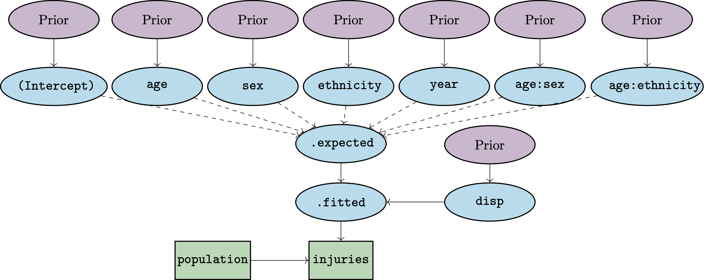

```{r, include = FALSE}
knitr::opts_chunk$set(
  collapse = TRUE,
  comment = "#>",
  fig.width = 7,
  fig.height = 4,
  message = FALSE
)
```

# Introduction

`bage` (= "Bayesian" + "age") implements Bayesian hierarchical models for rates, probabilities, and means. The rates, probabilities, and means are cross-classified by variables such as age, sex, region, and time. Models in `bage` can be used for estimation and for forecasting. 

`bage` models are built out of smaller submodels. A model for mortality rates, for instance, might contain submodels describing how rates vary over age, sex, and time. 

Internally, `bage` draws on package [TMB](https://CRAN.R-project.org/package=TMB) for fitting. `TMB` is fast and can handle large datasets.

This vignette introduces the main features of `bage`, using data on injuries as a case study.


# Preliminaries

## Packages

We begin by loading the packages that we will need for analysing the injuries data. Loading `bage` automatically loads package `rvec`, which contains functions for working with draws from probability distributions. Package `poputils` contains functions for working with demographic data. Packages `dplyr` and `tidyr` are core [tidyverse](https://www.tidyverse.org) packages for manipulating data. We use `ggplot2` for graphics.

```{r setup}
library(bage)
library(poputils)
library(dplyr)
library(tidyr)
library(ggplot2)
```

## Data

We analyse a dataset called `nzl_injuries`. The dataset is included in `bage`. It contains counts of fatal injuries and population in New Zealand, classified by age, sex, ethnicity, and year.

```{r}
head(nzl_injuries)
```

```{r}
nzl_injuries |>
  filter(year %in% c(2000, 2006, 2012, 2018)) |>
  ggplot(aes(x = age_mid(age), y = injuries / popn, color = sex)) +
  facet_grid(vars(ethnicity), vars(year)) +
  geom_line() +
  xlab("age") +
  theme(legend.position = "top",
        legend.title = element_blank())
```

# Specifying a model

## Functions for specifying models

We specify a model where counts of injuries are treated as a random draws from Poisson distributions. The expected number of injuries varies with different combinations of age, sex, ethnicity, and year.

```{r}
mod <- mod_pois(injuries ~ age * sex + age * ethnicity + year,
                data = nzl_injuries,
                exposure = popn)
```

Binomial models are specified with function `mod_binom()` and normal models with function `mod_norm()`.


## Model structure

The resulting model has the following structure:

```{r, echo=FALSE, out.width="90%"}

```

The number of injuries occurring within each combination of age, sex, ethnicity, and time reflects (i) the population at risk and (ii) an underlying rate that in `bage` is referred to as `.fitted`. The expected value for `.fitted` is obtained by summing up values for the intercept, age effect, sex effect, and so forth. The actual value of `.fitted` can diverge from `.expected`: the amount of divergence is governed by the `disp` (dispersion) parameter.

The model terms are all given "prior distributions".  A prior distribution is a submodel capturing features of the unknown quantity or quantities being estimated. Possible features include the range within which the quantity is likely to fall, or the amount of smoothness expected in series of values. Priors distributions are a distinctive feature of Bayesian methods.

## Printing the model object

Printing a model object provides information on its structure:

```{r}
mod
```

The table in the the middle of the printout above shows the default prior distribution assigned to each term. We return to priors in Section \@ref(sec:priors).

The bottom row of the printed object shows various model settings. `n_draw` is the number of random draws produced by extractor functions, which we discuss in Section \@ref(sec:outputs). `var_time`, `var_age`, and `var_sexgender` are the names of the variables in `nzl_injuries` that represent time, age, and sex or gender. If `bage` fails to correctly identify these variables, they can be identified using functions such as `set_var_time()`. 


# Fitting a model {#sec:fitting}

## fit()

Function `mod_pois()` specifies a model, but does not actually estimate any of the unknown quantities in the model. For that, we need function `fit()`.

```{r}
mod <- mod |>
  fit()
```

## Reprinting the model object

The printout for a fitted model differs from that of an unfitted model.

```{r}
mod
```

Among other things, a new row appears at the bottom of the printout, providing information about the fitting process. The most important value piece of information is whether the calculations have converged.

One thing the printout does not include is estimates for the model parameters. The reason for excluding them is that there are too many. Statistical models in other R packages often focus on one or two key parameters, such a parameter measuring a treatment effect. In contrast, models in `bage` often estimate values for thousands, or tens of thousands, of parameters.

To obtain the estimates from a fitted model, we need specialised extractor functions, which we discuss next.

# Extracting outputs {#sec:outputs}

## Extractor functions

The two most important extractor functions in `bage` are `augment()` and `components()`. Both of these are generic functions that work on many sorts of R objects (see [here](https://generics.r-lib.org/index.html) and [here](https://www.tidymodels.org/learn/develop/broom/#glossary)).

## augment()

`augment()` returns the original dataset plus some additional columns of estimated values,

```{r}
aug <- mod |>
  augment()
aug
```

The additional columns are `.observed`, `.fitted`, and `.expected`.

```{r}
aug |>
  select(.observed, .fitted, .expected) 
```

In a Poisson model with exposures,

- `.observed` is a "direct" estimate of the rate, obtained by dividing the the outcome variable by the population at risk;
- `.expected` is a model-based estimate of the rate, based purely on model predictors (eg age, sex, time); and
- `.fitted` is a model-based estimate of the rate that is a compromise between `.observed` and `.expected`.

## components()

`components()` is used to extract values for higher-level parameters. It returns values for all the parameters.

```{r}
comp <- mod |>
  components()
comp
```

The output from `components()` may require a bit of tidying,

```{r}
age_effect <- comp |>
  filter(term == "age",
         component == "effect") |>
  select(age = level, .fitted)
age_effect
```

## Posterior samples

The output from a Bayesian model is draws from the "posterior distribution" for unknown quantities. The posterior distribution is a probability distribution that describes what is implied about the unknown quantities in the model after the combining model assumptions (including priors) and the data.

## Rvecs

Draws from probability distributions can be awkward to work with, so `bage` uses a special type of vector called an "rvec", implemented by package `rvec`. An rvec contains multiple draws, but tries to behave as much as possible like a standard vector. The printout of `.fitted` and `.expected` in the `aug` object above shows medians and 95\% credible intervals.

## Graphing outputs

The best way to understand output from a fitted model it to graph it. We first need to prepare data for the graph. We select values for 2018 and use the `draws_ci()` function from `rvec` to create 95\% credible intervals.

```{r}
data_plot <- aug |>
  filter(year == 2018) |>
  mutate(draws_ci(.fitted))
data_plot |>
  select(starts_with(".fitted"))
```

We then use `ggplot()` to visualise the outputs. A good way to display `bage` output is to use `geom_ribbon()` to plot credible intervals, `geom_line()` to plot model-based point estimates, and `geom_point()` to plot direct estimates.

```{r}
ggplot(data_plot, aes(x = age_mid(age))) +
  facet_grid(vars(sex), vars(ethnicity)) +
  geom_ribbon(aes(ymin = .fitted.lower,
                  ymax = .fitted.upper),
              fill = "lightblue") +
  geom_line(aes(y = .fitted.mid),
            color = "darkblue") +
  geom_point(aes(y = .observed),
             color = "red") +
  xlab("age")
```

# Priors {#sec:priors}

## Priors in Bayesian models

In a Bayesian model, every parameter needs to be assigned a prior distribution. When the data provides abundant information about the parameter, the particular choice of prior distribution usually has little effect on the ultimate estimates for the parameter. But when the data provides only limited information, different priors can lead to very different estimates. The choice of prior is particularly important when forecasting, since the data provides provides only indirect information about the future.

## Current priors in bage

`help(priors)` produces a list of priors that have been implemented in `bage`. 

Some examples:

- `NFix()`. Each element of the term being modeled is drawn from a normal distribution with mean `0`, and standard deviation `sd`. By default, `sd` is 1.
- `N()`. Like `NFix()`, but `sd` is estimated from the data.
- `RW()`. The elements of the term being modeled follow a random walk. This is appropriate for terms involving time and age, where neighboring elements are strongly correlated.
- `AR1()`. First-order autoregressive process. Suitable for time series that revert to a mean value.

## Defaults

`bage` uses the following rules to assign default priors to a model term:

- if the term has less than 3 elements, use `NFix()`;
- otherwise, if the term involves time, use `RW()`, with time as the `along' dimension;
- otherwise, if the term involves age, use `RW()`, with age as the `along' dimension;
- otherwise, use `N()`.

Priors can be over-ridden using `set_prior()`:

```{r}
mod <- mod |>
  set_prior(year ~ AR1())
```

Replacing a prior deletes any existing estimates and returns a model to an 'unfitted' state.

```{r}
is_fitted(mod)
```

So we re-fit the model.

```{r}
mod <- mod |>
  fit()
```

## SVD-based priors

`bage` implements a special type of prior based on applying a singular value decomposition (SVD) to data from an international database. These SVD-based priors represent the age-sex patterns in demographic processes such as fertility, mortality, and labor force participation in a parsimonious way. The model below, for instance, uses SVD-based priors for age effects and age-time interactions in a model of regional fertility rates in Korea. Note that the number of free parameters (denoted `n_par_free`) for `age` and `age:time` in the printout below is much less than the total number of parameters (denoted `n_par`) for `age` and `age:time`.

```{r}
mod_births <- mod_pois(births ~ age * region + age * time,
                       data = kor_births,
                       exposure = popn) |>
  set_prior(age ~ SVD(HFD)) |>
  set_prior(age:time ~ SVD_RW(HFD)) |>
  fit()
mod_births
```

# Covariates

The main predictors in a `bage` model are the variables, such as age and sex, that are used to classify the outcome. However, `bage` does allow additional variables in `data` to be used as predictors. We refer to these additional variables as covariates, and we add them to a model using function `set_covariates()`:

```{r}
mod_pois(births ~ age * region + age * time,
         data = kor_births,
         exposure = popn) |>
  set_covariates(~ gdp_pc_2023 + dens_2020)
```

# Forecasting

Forecasts can be constructed by calling function `forecast()` on a model object. When the `output` argument of `forecast()` is `"augment"` (the default), `forecast()` produces values like those produced by `augment()`.

```{r}
aug_forecast <- mod |>
  forecast(labels = 2019:2028)
names(aug_forecast)
```

When the `output` argument is `"components"`, `forecast()` produces values like those produced by `components()`.

```{r}
comp_forecast <- mod |>
  forecast(labels = 2019:2028,
           output = "components")
comp_forecast
```

When the argument `include_estimates` is `TRUE`, the return value includes historical estimates. This is useful for plotting.

```{r}
data_forecast <- mod |>
  fit() |>
  forecast(labels = 2019:2028,
           include_estimates = TRUE) |>
  filter(sex == "Female",
         age %in% c("10-14", "25-29", "40-44")) |>
  mutate(draws_ci(.fitted))

ggplot(data_forecast, aes(x = year)) +
  facet_grid(vars(age), vars(ethnicity)) +
  geom_ribbon(aes(ymin = .fitted.lower,
                  ymax = .fitted.upper),
              fill = "lightblue") +
  geom_line(aes(y = .fitted.mid),
            color = "darkblue") +
  geom_point(aes(y = .observed),
             color = "red")  
```

# Imputation

`bage` automatically accommodates missing values in the outcome variables. We illustrate with a version of the injuries dataset where values for 2010--2014 are set to `NA`.

```{r}
years_mis <- 2010:2014

injuries_mis <- nzl_injuries |>
  mutate(injuries = if_else(year %in% years_mis, NA, injuries))
```

We fit our exactly the same model that we use for the complete dataset.

```{r}
mod_mis <- mod_pois(injuries ~ age * sex + age * ethnicity + year,
                    data = injuries_mis,
                    exposure = popn) |>
  fit()
```

`bage` creates a new variable, called `.injuries` containing imputed values for the missing outcomes.

```{r}
mod_mis |>
  augment() |>
  filter(year %in% years_mis)
```

Rates estimates in years where the outcome is missing have wider credible intervals than rates estimates in years where the outcome is observed.

```{r}
data_plot_mis <- mod_mis |>
  augment() |>
  filter(age == "20-24") |>
  mutate(draws_ci(.fitted))

ggplot(data_plot_mis, aes(x = year)) +
  facet_grid(vars(sex), vars(ethnicity)) +
  geom_ribbon(aes(ymin = .fitted.lower,
                  ymax = .fitted.upper),
              fill = "lightblue") +
  geom_line(aes(y = .fitted.mid),
            color = "darkblue") +
  geom_point(aes(y = .observed),
             color = "red") +
  xlab("age")
```

If the value for exposure, size, or weights is missing, then the associated row from `data` is omitted from the likelihood, and no imputations for that row are made. Missing values for classifying variables are skipped over in the same way.


# Data models

Many datasets in applied demography have some sort of measurement error: units within the target population are missed, for instance, or are double-counted. In `bage`, measurement error can be explicitly incorporated into the analysis by adding a "data model" (also known as a measurement error model) to the base model.

Consider, for example, as dataset where, because of errors in the data collection process, responses for females are expected to be inflated by 5% and responses for males are expected to be inflated by 6%. We might extend our base model as follows:

```{r, eval = FALSE}
prob_under <- data.frame(sex =  c("Female", "Male"),
                         mean = c(0.05,     0.06),
			 disp = c(0.02,     0.02))

mod_under <- mod_base |>
  set_datamod_undercount(prob = prob_under) 
```

The current choice of data models in `bage` can be views by calling `help(datamod)`.


# Confidentialization

Data producers often confidentialize their data before they make it publicly available. The `nzl_injuries` dataset is one example. Statistics New Zealand has randomly-rounded the counts of injuries to multiples of 3. 

To deal with confidentialization, we describe the confidentialization process to our model.

```{r}
mod <- mod |>
  set_confidential_rr3() |>
  fit()
```

The results from calling `augment()` now include a variable called `.injuries` with estimated values for the true, unrounded injury counts.

```{r}
mod |>
  augment()
```


# Model checking

## Replicate data

A standard Bayesian approach to checking a model is to use the model to generate simulate data and see if the simulated data looks like the actual data. Function `replicate_data()` creates multiple sets of simulated data.

```{r}
rep_data <- mod |>
  replicate_data()
rep_data
```

Comparing full datasets is difficult, so the usual strategy is to calculate summary measures that capture some important feature of the data, and compare those instead. Here we see if the model is properly capturing male-female differences in injury rates.

```{r}
sex_ratio <- rep_data |>
  count(.replicate, year, sex, wt = injuries) |>
  pivot_wider(names_from = sex, values_from = n) |>
  mutate(ratio = Male / Female)
sex_ratio
```


We graph the results and see if the original data looks like it was drawn from the same underlying distribution as the simulated data.

```{r}
ggplot(sex_ratio, aes(x = year, y = ratio)) +
  facet_wrap(vars(.replicate)) +
  geom_line()
```


## Simulation studies

A simulation study, where we create the data ourselves and hence know the true values for the parameters, can be a useful way of assessing model performance. In the example below, we use function `report_sim()` to perform a simple simulation study where the true population is generated using a first-order random walk, but the estimation model assumes that the population is generated using a second-order random walk.

```{r}
set.seed(0)

## Create simulated data
fake_data <- data.frame(year = 2001:2010, 
                        population = NA)

## Define the true data-generating model
mod_rw <- mod_pois(population ~ year,
                   data = fake_data,
                   exposure = 1) |>
  set_prior(`(Intercept)` ~ NFix(sd = 0.1)) |>
  set_prior(year ~ RW(s = 0.1, sd = 0.1))

## Define the estimation model
mod_rw2 <- mod_pois(population ~ year,
                    data = fake_data,
                    exposure = 1) |>
  set_prior(year ~ RW2())

## Run the simulation
report_sim(mod_est = mod_rw2, mod_sim = mod_rw)
```

## Prior predictive checks

Another way of gaining insights about a model is to look at estimates based purely on the priors, without using data on the outcome variable. In `bage`, this can be done by calling `augment()`, `components()` or `forecast()` on an unfitted version of the model.

```{r}
mod |>
  unfit() |>
  components()
```

# Future development of bage

## Future features

`bage` is a new package, and still under very active development. Some features that are next on the list are:

- **Priors** More options for priors, eg a damped linear trend.
- **Sets of priors** Pre-specified collections of priors for specific purposes such as modelling fertility rates
- **Documentation** More vignettes and examples.
- **Model choice** Tools for model comparison and model choice

## Experimental status

`bage` currently has an [](https://lifecycle.r-lib.org/articles/stages.html#experimental) life cycle badge, to warn users that some features of the `bage` interface, such as function arguments, are still evolving. We hope to graduate from experimental status by the end of 2025.

## Bug reports and feature requests

We would be grateful for bug reports or suggestions for features. The best way to do so is to raise an issue on the [bage GitHub repository](https://github.com/bayesiandemography/bage/issues).
