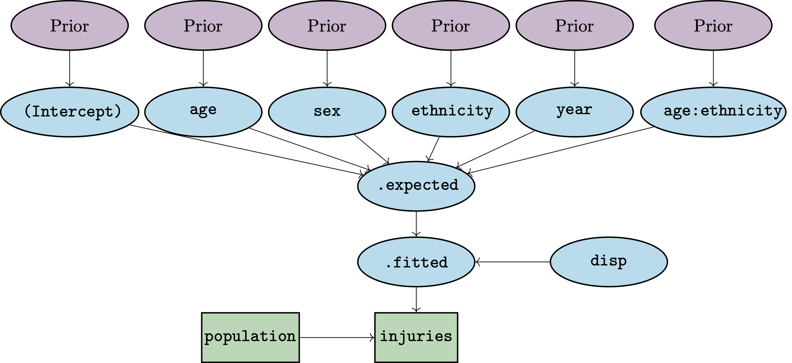

```{r, include = FALSE}
knitr::opts_chunk$set(
  collapse = TRUE,
  comment = "#>",
  fig.width = 7,
  fig.height = 4
)
```

# Introduction

**bage** (= "Bayesian" + "age") implements Bayesian hierarchical models for rates, probabilities, and means, where the rates, probabilities and means are classified by variables such as age, sex, and region. Models in **bage** can be used for estimation and for forecasting. 

The models in **bage** are hierarchical in that they are built out of smaller submodels. A model for mortality rates, for instance, might contain submodels describing how rates vary over age, sex, and time. 

Internally, **bage** draws on package [TMB](https://CRAN.R-project.org/package=TMB) to fit the models. **TMB** is fast and can handle large datasets -- characteristics that are inherited by **bage**.

This vignette introduces the main features of **bage**, using data on injuries.


# Preliminaries

## Packages

We begin by loading the packages that we will need for the analysis of the injuries data. Loading **bage** automatically loads package **rvec**, which contains functions for  working with draws from probability distributions. Package **poputils** contains functions for working with demographic data. Packages **dplyr** and **tidyr** are core [tidyverse](tidyverse.org) packages for manipulating data. We use **ggplot2** to graph inputs and outputs.

```{r setup}
library(bage)
library(poputils)
library(dplyr)
library(tidyr)
library(ggplot2)
```

## Data

We analyse a dataset called `nzl_injuries` that is included in the **bage** package. The dataset contains counts of injuries and population in New Zealand, classified by age, sex, ethnicity, and year.

```{r}
head(nzl_injuries)
```

```{r}
nzl_injuries |>
  filter(year %in% c(2000, 2006, 2012, 2018)) |>
  ggplot(aes(x = age_mid(age), y = injuries / popn, color = sex)) +
  facet_grid(vars(ethnicity), vars(year)) +
  geom_line() +
  xlab("age") +
  theme(legend.position = "top",
        legend.title = element_blank())
```

# Specifying a model

## Functions for specifying models

We specify a model in which, within each combination of age, sex, ethnicity, and year, injuries are treated as a random draw from a Poisson distribution. The function used to specify a Poisson model is `mod_pois()`. Binomial models can be specified with function `mod_binom()` and normal models with function `mod_norm()`.

The first argument to `mod_pois()` is an R-style formula identifying the outcome variable and the combinations of predictor variables to be used in the model. 

```{r}
mod <- mod_pois(injuries ~ age * sex + age * ethnicity + year,
                data = nzl_injuries,
                exposure = popn)
```

## Model structure

The resulting model has the following structure:

```{r, echo=FALSE, out.width="90%", fig.cap = "Structure of model. Rectangles denote data, ellipses denote unknown quantities that are inferred within the model, solid arrows denote probabilistic relationships, and dashed arrows denote deterministic relationships."}

```

The number of injuries occurring within each combination of age, sex, ethnicity, and time reflects (i) the population at risk and (ii) an underlying rate that in **bage** is referred to as `.fitted`. The expected value for `.fitted` is obtained by summing up values for the intercept, age effect, sex effect, and so forth. The actual value of `.fitted` can diverge from `.expected`: the amount of divergence is governed by the `disp` (dispersion) parameter.

The model terms are all given "prior distributions".  A prior distribution is a submodel capturing features of the unknown quantity or quantities being estimated. Possible features include the range within which the quantity is likely to fall, or the amount of smoothness expected in series of values. Priors distributions are a distinctive feature of Bayesian methods.

## Printing the model object

Printing a model object provides information on its structure:

```{r}
mod
```

The table in the the middle of the printout above shows the default prior distribution assigned to each term. We return to priors in Section \@ref(sec:priors).

The bottom row of the printed object shows various model settings. `n_draw` is the number of random draws produced by extractor functions, which we discuss in Section \@ref(sec:outputs). `var_time`, `var_age`, and `var_sexgender` are the names of the variables in `nzl_injuries` that represent time, age, and sex or gender. If **bage** fails to correctly identify these variables, they can be identified using functions such as `set_var_time()`. 


# Fitting a model {#sec:fitting}

## fit()

Function `mod_pois()` specifies a model, but does not actually estimate any of the unknown quantities in the model. For that, we need function `fit()`.

```{r}
mod <- mod |>
  fit()
```

## Reprinting the model object

The printout for a fitted model differs from that of an unfitted model.

```{r}
mod
```

Among other things, a new row appears at the bottom of the printout, providing information about the fitting process. The most important value piece of information is whether the calculations have converged. In our case, they have.

# Extracting outputs {#sec:outputs}

## Extractor functions

Function `fit()` derives values for the unknown quantities, but does not itself return them. For that, we need an extractor function. The two most important such functions are `augment()` and `components()`. Both of these are generic functions that work on many sorts of R objects (see [here](https://generics.r-lib.org/index.html) and [here](https://www.tidymodels.org/learn/develop/broom/#glossary)).

## augment()

`augment()` returns the original dataset plus some additional columns of estimated values,

```{r}
aug <- mod |>
  augment()
aug
```

The columns with the estimates are `.observed`, `.fitted`, and `.expected`.

```{r}
aug |>
  select(.observed, .fitted, .expected) 
```

In the case of a Poisson model with exposures, 
- `.observed` is the "direct" estimate of the rate, that is, the reported value for the outcome divided by the reported value for the population at risk;
- `.expected` is a model-based estimate of the rate based purely on model predictors (eg age, sex, time); and
- `.fitted` is a model-based estimate of the rate that is a compromise between `.observed` and `.expected`.

## Posterior samples

The output from a Bayesian model typically consists of draws from the "posterior distribution" for unknown quantities. The posterior distribution is a probability distribution that describes what we know about the unknown quantities in the model after applying our combining our model assumptions (our priors) and our data.

## Rvecs

Draws from probability distributions can be awkward to work with, so **bage** uses a special type of vector, called an "rvec", implemented by package **rvec**. An rvec contains multiple draws, but tries to behave as much as possible like a standard numerical vector. The printout of `.fitted` and `.expected` in the `aug` object above shows medians and 95\% credible intervals.

## Graphing outputs

The best way to understand output from a fitted model it to graph it. We first need to prepare data for the graph. We select values for 2018 and use the `draws_ci()` function from **rvec** to create 95\% credible intervals.

```{r}
data_plot <- aug |>
  filter(year == 2018) |>
  mutate(draws_ci(.fitted))
data_plot |>
  select(starts_with(".fitted"))
```

We then use `ggplot()` to visualise the outputs. In the figure below we use use `geom_ribbon()` for credible intervals, `geom_line()` for model-based point estimates, and `geom_point()` for direct estimates.

```{r}
ggplot(data_plot, aes(x = age_mid(age))) +
  facet_grid(vars(sex), vars(ethnicity)) +
  geom_ribbon(aes(ymin = .fitted.lower,
                  ymax = .fitted.upper),
              fill = "lightblue") +
  geom_line(aes(y = .fitted.mid),
            color = "darkblue") +
  geom_point(aes(y = .observed),
             color = "red")
```

## components()

`components()` is used to extract values for higher-level parameters. It returns values for all the parameters.

```{r}
comp <- mod |>
  components()
comp
```

A little bit of manipulation is required to extract and graph the parameter of interest,

```{r}
age_effect <- comp |>
  filter(term == "age",
         component == "effect") |>
  select(age = level, .fitted) |>
  mutate(draws_ci(.fitted))

ggplot(age_effect, aes(x = age_mid(age))) +
  geom_ribbon(aes(ymin = .fitted.lower,
                  ymax = .fitted.upper),
              fill = "lightblue") +
  geom_line(aes(y = .fitted.mid),
            color = "darkblue")
```

Wide credible intervals like those for the age effect above are common for high-level parameters. The wide intervals are a symptom of the fact that the individual parameters themselves are not well defined, even though the sum of the parameters (which is ultimately the thing we care about) are not.

# Priors {#sec:priors}

## Priors in Bayesian models

In a Bayesian model, every unknown quantity needs a prior distribution. The less information a dataset contains on a parameter, the more the estimate of that parameter is influenced by the prior. For instance, if a dataset has many observations for one group, and only a few observations for a second group, then estimates for the for the second group will be much more sensitive to the choice of prior than estimates for teh second group. The choice of prior is particularly important when forecasting, since, by definition, there is no data for events in the future.

## Current priors in bage

`help(priors)` produces a list of the priors that have been implemented so far in **bage**. 

The two priors in the injuries model above are `NFix()` and `RW()`:

With `NFix()`, each element of the term being modeled is drawn from a normal distribution with mean `0`, and standard deviation `sd`. By default, `sd` is 1.

With `RW()`, elements follow a random walk. `RW()` is suitable for terms where elements that are neighbors are more strongly correlated than elements that are distant from each other. It capture that idea that, for instance, rates for age groups 20--24 and 25--29 are likely to be more strongly correlated than rates for age groups 20--24 and 70--74.

## Defaults

**bage** uses the following rules to assign default priors to a model term:

- if the term has less than 3 elements, use `NFix()`;
- otherwise, if the term involves time, use `RW()`, with time as the `along' dimension;
- otherwise, if the term involves age, use `RW()`, with age as the `along' dimension;
- otherwise, use `N()`.

The `N()` prior is the same as the `NFix()` prior, except that the standard deviation term is estimated from the data rather than specified in advance.

Priors can be over-ridden using `set_prior()`:

```{r}
mod <- mod |>
  set_prior(year ~ AR1())
mod
```

Note that replacing a prior deletes any existing estimates and reverts a model to 'unfitted'.

We re-fit the model.

```{r}
mod <- mod |>
  fit()
```


# Forecasting

To use a model for forecasting, call function `forecast()` on the model object. When `output` is `"augment"` (the default), `forecast()` produces values like those produced by `augment()`.

```{r}
aug_forecast <- mod |>
  forecast(labels = 2019:2028)
aug_forecast
```

When `output` is `"components"`, `forecast()` values like those produced by `components()`.

```{r}
comp_forecast <- mod |>
  forecast(labels = 2019:2028,
           output = "components")
comp_forecast
```

When `include_estimates` to `TRUE`, the return value includes historical estimates, which can be useful for making graphs.

```{r}
data_forecast <- mod |>
  fit() |>
  forecast(labels = 2019:2028,
           include_estimates = TRUE) |>
  filter(sex == "Female",
         age %in% c("10-14", "25-29", "40-44")) |>
  mutate(draws_ci(.fitted))

ggplot(data_forecast, aes(x = year)) +
  facet_grid(vars(age), vars(ethnicity)) +
  geom_ribbon(aes(ymin = .fitted.lower,
                  ymax = .fitted.upper),
              fill = "lightblue") +
  geom_line(aes(y = .fitted.mid),
            color = "darkblue") +
  geom_point(aes(y = .observed),
             color = "red")  
```


# Model checking

## Replicate data

A standard Bayesian approach to checking a model is to use the model to generate simulate data and see if the simulated data looks like the actual data. Function `replicate_data()` creates multiple sets of simulated data.

```{r}
rep_data <- mod |>
  replicate_data()
rep_data
```

Comparing full datasets is difficult, so the usual strategy is to calculate summary measures that capture some important feature of the data, and compare those. Here we see if the model is properly capturing the male-female ratio in injuries.


```{r}
sex_ratio <- rep_data |>
  count(.replicate, year, sex, wt = injuries) |>
  pivot_wider(names_from = sex, values_from = n) |>
  mutate(ratio = Male / Female)
sex_ratio
```


We graph the results and see if the original data looks like it was drawn from the same underlying distribution as the simulated data.

```{r}
ggplot(sex_ratio, aes(x = year, y = ratio)) +
  facet_wrap(vars(.replicate)) +
  geom_line()
```


## Simulation studies

A simulation study, where we create the data ourselves, and hence know what the underlying true values are, can be a useful way of assessing model performance. Function `report_sim()` aims to make it easy to conduct simulation studies. In the example below, we construct data where population follows a first-order random walk, apply a model that assumes that population follows a second-order random walk, and then measure the performance of the estimation model.

```{r}
set.seed(0)
fake_data <- data.frame(year = 2001:2010, 
                        population = NA)

mod_rw <- mod_pois(population ~ year,
                   data = fake_data,
                   exposure = 1) |>
  set_prior(`(Intercept)` ~ NFix(sd = 0.1)) |>
  set_prior(year ~ RW(s = 0.1, sd = 0.1))

mod_rw2 <- mod_pois(population ~ year,
                    data = fake_data,
                    exposure = 1) |>
  set_prior(year ~ RW2())

report_sim(mod_est = mod_rw2, mod_sim = mod_rw)
```

## Prior predictive checks

Another way of gaining insights about a model is to see what the model implies about the unknowns *before*, based purely on the priors, without using the data. In **bage**, this can be done by calling `augment()`, `components()` and `forecast()` on an unfitted version of the model.

```{r}
mod |>
  unfit() |>
  components()
```

# SVD-based models


# Imputation


# Future development of 'bage'

## Experimental status

## Future features

- Covariates
- More data models
- Informative priors (including sets)
- More priors (eg damped linear trend)
- More documentation
- Automated model choice
- 

## Bug reports and feature requests


