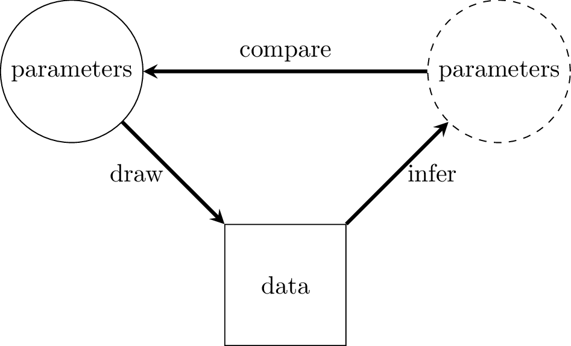

```{r, include = FALSE}
knitr::opts_chunk$set(
  collapse = TRUE,
  comment = "#>"
)
```

# Introduction

Simulation studies can be used to assess the performance of a model. The basic idea is to generate some parameter values, use these parameters to generate some data, use the data to try to infer the original parameter values, and then see how close the inferred parameter values are to the actual parameter values.
```{r, echo=FALSE, out.width="50%", fig.cap = "Simulation study of a model"}

```
Function `report_sim()` automates the process of doing a simulation study. We are still experimenting with `report_sim()`, and the interface may change. Suggestions are welcome, ideally through raising an issue [here](https://github.com/bayesiandemography/bage/issues).

# Estimation model matches data generation model

The most straightforward type of simulation is when the `estimation model' used to do the inference matches the `data generation model' used to create the data. Even when the estimation model matches the data generation model, the inferred values for the parameters will not exactly reproduce the actual values, since data is drawn at random, and provides a noisy signal about parameters it was generated from. However, if the experiment is repeated many times, with a different randomly-drawn dataset each time, the errors should more or less average out at zero, 50\% credible intervals should contain the true values close to 50\% of the time, and 95\% credible intervals should contain the true values close to 95\% of the time.

To illustrate, we use investigate the performance of a model of divorce rates in New Zealand. We reduce the number of ages and time periods to speed up the calculations.
```{r}
library(bage)
library(dplyr, warn.conflicts = FALSE)
library(poputils)

divorces_small <- nzl_divorces |>
  filter(age_upper(age) < 40,
         time >= 2016) |>
  droplevels()

mod <- mod_pois(divorces ~ age * sex + time,
                data = divorces_small,
		            exposure = population)
mod		
```

To do the simulation study, we pass the model to `report_sim()`. If only one model is supplied, `report_sim()` assumes that that model should be used as the estimation model and as the data generation model. By default `report_sim()` repeats the experiment 100 times, generating a different dataset each time.

```{r}
set.seed(0)
res <- report_sim(mod_est = mod)
res
```

The output from `report_sim()` is a list of two data frames. The first data frame contains results for parameters associated with the `components()` function: main effects and interactions, associated hyper-parameters, and dispersion. The second data frame contains results for parameters associated with the `augment()` function: the lowest-level rates parameters. 

As can be seen in the results, the errors do not average out at exactly zero, 50\% credible intervals do not contain the true value exactly 50\% of the time, and 95\% credible intervals do not contain the true value exactly 95\% of the time. However, increasing the number of simulations from the default value of 100 to, say, 1000 will reduce the average size of the errors closer to zero, and bring the actual coverage rates closer to their advertised values. When larger values of `n_sim` are used, it can be helpful to use parallel processing to speed up calculations, which is done through the `n_core` argument.

One slightly odd feature of the results is that the mean for `.expected` is very large. This reflects the fact that the data generation model draws some extreme values. We are developing a set of more informative priors that should avoid this behavior in future versions of **bage**.


# Estimation model different from data generation model

In actual applications, no estimation model ever perfectly describes the true data generating process. It can therefore be helpful to see how robust a given model is to misspecification, that is, to cases where the estimation model differs from the data generation model. 

With `report_sim()`, this can be done by using one model for the `mod_est` argument, and a different model for the `mod_sim` argument.

Consider, for instance, a case where the time effect is generated from an `AR1()` prior, while the estimation model continues to use the default value of a `RW()` prior,

```{r}
mod_ar1 <- mod |>
  set_prior(time ~ AR1())
mod_ar1	
```

We set the `mod_sim` argument to `mod_ar1` and generate the report.

```{r}
res_ar1 <- report_sim(mod_est = mod, mod_sim = mod_ar1)
res_ar1
```
In this case, although actual coverage for the hyper-parameters (in the `components` part of the results) now diverges from the advertised coverage, coverage for the low-level rates (in the `augment` part of the results) is still close to advertised coverage.

# The relationship between `report_sim()` and `replicate_data()`

Functions `report_sim()` and `replicate_data()` overlap, in that both use simulated data to provide insights into model performance. Their aims are, however, different. Typically, `report_sim()` is used before fitting a model, to assess its performance across a random selection of possible datasets, while `replicate_data()` is used after fitting a model, to assess its performance on the dataset to hand.
